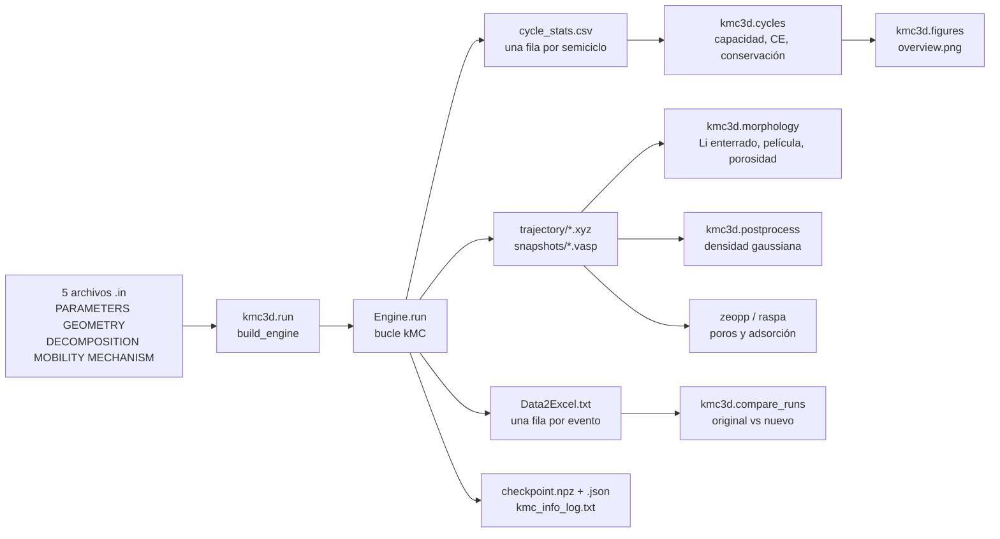
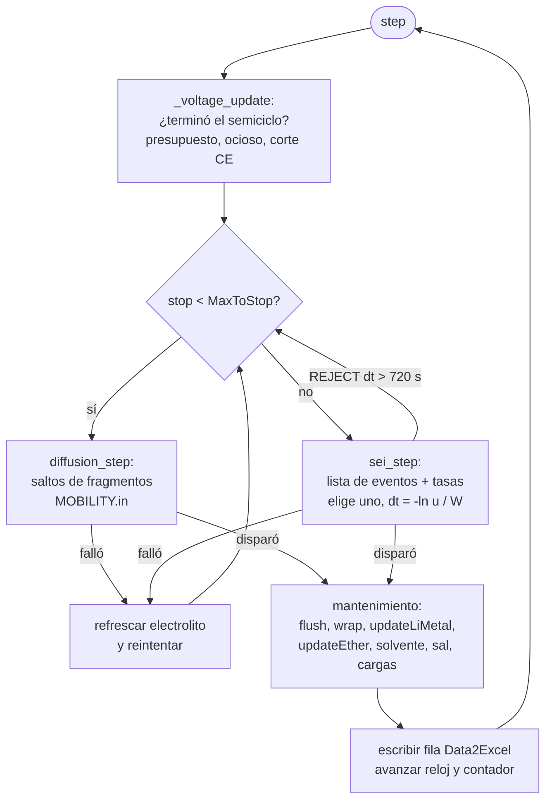
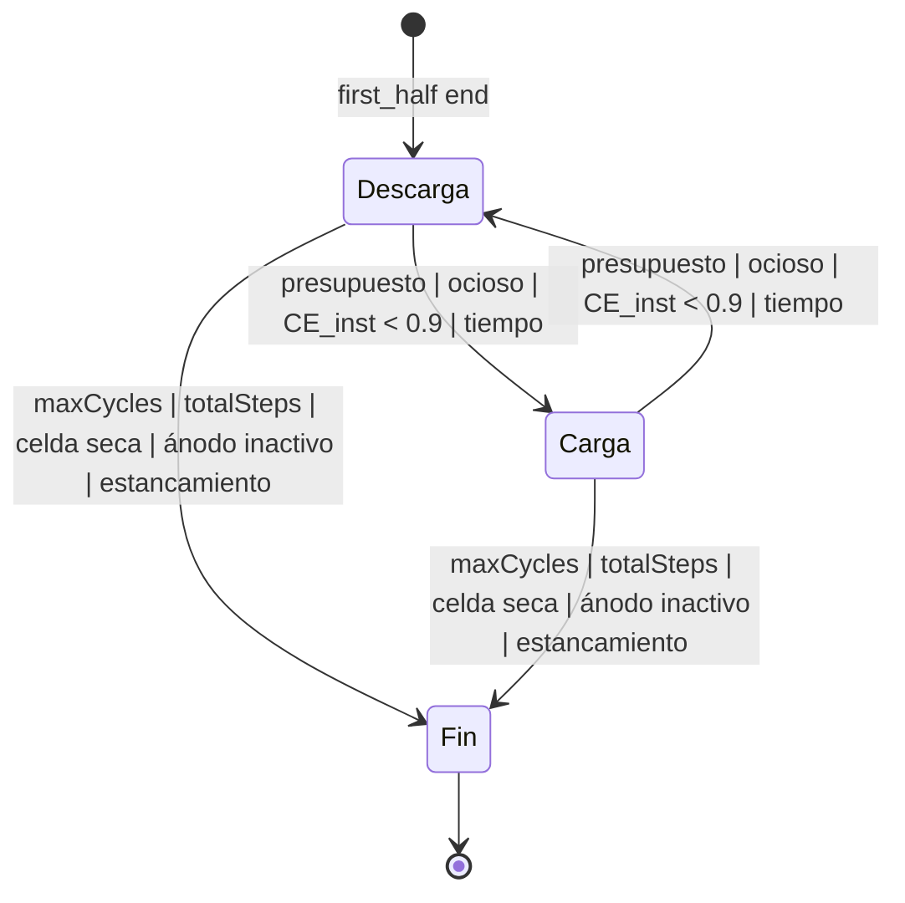
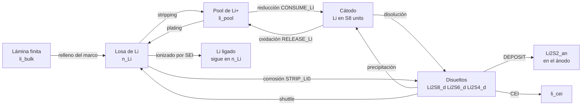
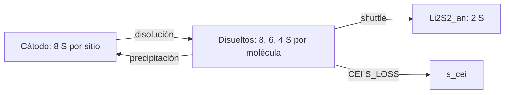
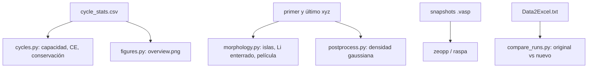

# Guía a profundidad del proyecto kmc3d

Modelo cinético de Monte Carlo (kMC) de una celda litio-azufre sobre red fija.
Guía de estudio en español. Estado del proyecto: hito 4 (2026-09-30).
Autor del proyecto: Carlos Guerrero, grupo de la Dra. Perla Balbuena, Texas A&M, Battery500.

Nota sobre el idioma: todo el código, los comentarios, los documentos del
repositorio y los nombres de variables están en inglés (convención del
proyecto). Esta guía es la excepción deliberada: está en español para
estudiar y para usarla como contexto en otras conversaciones. Cuando aquí se
cite un nombre de archivo, palabra clave o columna, se escribe exactamente
como aparece en el código.

---

## Índice

1. Para qué sirve esta guía y cómo leerla
2. El problema físico y químico que se aborda
3. Fundamentos del método kMC (con las ecuaciones)
4. La red cristalina del modelo
5. El motor original en C++: qué hace, cómo, y sus límites
6. kmc3d: arquitectura y pipeline completo
7. Los cinco archivos de entrada, línea por línea
8. El modelo de celda completa: balances, especies, reacciones
9. Cinética física: cada parámetro, cada referencia, cada decisión
10. El protocolo de ciclado: semiciclos, cortes y frenos
11. Escalas de tiempo, carga y espesor: el punto más delicado
12. Las salidas del motor: qué hay en cada archivo y columna
13. Post-procesamiento: cada módulo y cada script
14. Validación: la regla de "byte por byte"
15. Historia del proyecto: hitos, corridas, fallos y correcciones
16. Comparación original C++ contra kmc3d
17. Limitaciones actuales y trabajo pendiente
18. Estructura del repositorio, archivo por archivo
19. Flujo de trabajo práctico (Anaconda, git, GRACE)
20. Preguntas frecuentes
21. Glosario
22. Referencias con los datos que se usan de cada una

---

## 1. Para qué sirve esta guía y cómo leerla

Esta guía explica el proyecto de principio a fin: qué problema se estudia,
con qué método, cómo está construido el programa, qué se ha logrado, qué
falta y por qué cada decisión se tomó como se tomó. Está pensada para tres
usos: entender el proyecto a profundidad, defenderlo ante la asesora y ante
un comité, y servir de contexto en conversaciones futuras (se puede adjuntar
completa).

Si tienes poco tiempo, el orden recomendado es: sección 2 (el problema),
sección 3 (el método), sección 6 (el pipeline), sección 11 (escalas) y
sección 15 (historia). Con esas cinco secciones se entiende todo lo demás.

Convenciones tipográficas: `así` se escriben nombres de archivos, palabras
clave y columnas; las fórmulas se escriben en texto plano con notación
tipo LaTeX simplificada (por ejemplo `k = A exp(-Ea/kT)`); las cantidades
en la caja de simulación se dan en sitios de red, ángstrom (A) y segundos.

---

## 2. El problema físico y químico que se aborda

### 2.1 La batería litio-azufre en cuatro frases

Una celda Li-S tiene un ánodo de litio metálico, un cátodo de azufre (S8)
soportado en carbono, y un electrolito orgánico con una sal de litio. Al
descargar, el azufre se reduce y se litia por pasos hasta Li2S, y el litio
metálico se disuelve como Li+ que viaja por el electrolito. Al cargar, el
proceso se invierte. La capacidad teórica del azufre es 1672 mAh por gramo
(16 electrones por molécula de S8), unas cinco veces la de un cátodo de
óxido convencional, y por eso interesa.

### 2.2 Los tres problemas que limitan la vida de la celda

Primero, el ánodo de litio reacciona con el electrolito. El litio metálico
es tan reductor que descompone la sal y el solvente que lo tocan, formando
una capa sólida llamada SEI (solid electrolyte interphase) hecha de LiF,
Li2O, Li2CO3, sulfuros, fragmentos orgánicos, etc. Esa capa consume litio y
electrolito en cada ciclo. Además, al depositar litio (plating) y
disolverlo (stripping) la superficie se vuelve rugosa, se forman dendritas
y trozos de litio quedan aislados eléctricamente dentro del SEI: es el
"litio muerto" o "litio enterrado" (buried Li). La medida global de todo
esto es la eficiencia coulómbica (CE): la fracción de la carga depositada
que se recupera al disolver. Una celda buena tiene CE de 99.7 a 99.9 %, es
decir, pierde 0.1 a 0.3 % del litio en cada ciclo.

Segundo, los polisulfuros intermedios (Li2S8, Li2S6, Li2S4) son solubles.
Se disuelven del cátodo, viajan al ánodo, se reducen ahí químicamente
corroyendo litio, vuelven al cátodo, se reoxidan, y así sucesivamente: es el
"shuttle" de polisulfuros. Consume carga sin almacenarla (baja la CE) y
deposita Li2S2 y Li2S insolubles donde no deben.

Tercero, el cátodo también forma una capa: la CEI (cathode electrolyte
interphase), en este electrolito producida por la reducción del anión FSI
por los polisulfuros largos. Pasiva el cátodo y secuestra azufre.

### 2.3 El sistema concreto de este proyecto

Electrolito: LiFSI (bis(fluorosulfonil)imida de litio) 1.2 M en F5DEE
(1,2-dietoxietano fluorado, un éter con cinco flúores). Es el electrolito
de Yu et al. (Nature Energy 2022), que da CE de 99.74 a 99.90 % en Li||Cu, y
cuyos mecanismos de descomposición sobre litio calcularon Tan et al. (JACS
2024). Ánodo: litio metálico. Cátodo: S8. Temperatura: 298 K.

### 2.4 Por qué kMC y no otra cosa

La dinámica molecular ab initio (AIMD) resuelve los electrones y ve las
reacciones individuales, pero alcanza picosegundos y cientos de átomos; un
ciclo de batería dura horas. Los modelos continuos (como el DFN, Doyle-
Fuller-Newman) resuelven la celda completa durante miles de ciclos, pero no
tienen átomos ni morfología: el SEI es un parámetro. El kMC está en medio:
trata los átomos como sitios de una red y los procesos químicos como
eventos con una tasa (probabilidad por unidad de tiempo), y avanza el
tiempo saltando de evento en evento. Con eso alcanza miles de ciclos en
una caja de nanómetros, conserva la información espacial (dónde se forma el
SEI, qué litio queda enterrado) y usa como entrada las energías y tasas que
salen de DFT y de experimentos. Es el puente natural entre la escala
atomística del grupo (DFT/AIMD) y la escala de celda.

### 2.5 El objetivo del proyecto

Partir del kMC en C++ del grupo (una media celda de litio con electrolito,
pensada para ver el crecimiento del SEI) y generalizarlo a una celda
completa Li-S en Python: ánodo de litio, cátodo de azufre, polisulfuros,
shuttle, CEI, con conservación exacta de masa, cinética con base en la
literatura, y un post-procesamiento que dé capacidad, CE, morfología del
SEI y litio enterrado. Meta final: que la CE y la vida de la cella sean
salidas del modelo, no entradas, para poder comparar electrolitos.

---

## 3. Fundamentos del método kMC (con las ecuaciones)

### 3.1 La idea

El sistema está en un estado (qué especie ocupa cada sitio). Desde ese
estado hay una lista de eventos posibles (mover un fragmento a un sitio
vecino, depositar un litio, descomponer una molécula de sal, reducir una
unidad de S8...), cada uno con una tasa `k_i` en unidades de 1/s. La tasa
es la probabilidad por unidad de tiempo de que ese evento ocurra si el
sistema se queda como está. Con la lista completa se hace lo siguiente en
cada paso:

1. Se suma la tasa total `W = sum_i k_i`.
2. Se elige un evento con probabilidad `k_i / W` (el más rápido es el más
   probable, pero cualquiera puede salir).
3. Se ejecuta y se actualiza el estado.
4. Se avanza el reloj `dt = -ln(u) / W`, con `u` un número aleatorio
   uniforme en (0, 1). Este es el tiempo de espera de un proceso de Poisson
   de tasa `W`: si los eventos son rápidos, el tiempo avanza poco; si son
   lentos, mucho.

Este algoritmo se llama BKL (Bortz, Kalos y Lebowitz, 1975) o Gillespie
(1976). Es "libre de rechazo": cada paso ejecuta un evento, a diferencia del
Monte Carlo Metropolis donde muchos intentos se rechazan. El precio es que
hay que mantener la lista completa de tasas actualizada después de cada
evento; en la práctica eso es el 90 % del costo de cómputo, y la sección 6
explica cómo se acelera.

### 3.2 De dónde salen las tasas

Toda tasa del modelo se construye con una sola fórmula (sección 1 de
`docs/KINETICS_TABLE.md`):

```
k = globalA * sigma * k0 * exp( -(Ea - alpha (V - E0)) / kT )
```

donde `k0` es el prefactor (1/s), `Ea` la energía de activación (eV),
`alpha` el coeficiente de transferencia (adimensional, con signo), `V` el
potencial del electrodo (V), `E0` el potencial estándar del paso (V),
`kT = 0.0257 eV` a 298 K, `sigma` un factor de multiplicidad o de encendido
(0 apaga la reacción) y `globalA` un factor global heredado del original
(0.5). Los cuatro números por reacción (`sigma k0 Ea alpha E0`) son las
columnas de `DECOMPOSITION.in`.

Esa fórmula contiene tres casos físicos:

- Reacción química activada (Arrhenius): `alpha = 0`, entonces
  `k = k0 exp(-Ea/kT)`. Ejemplo: la difusión de un fragmento de SEI, o la
  descomposición del F5DEE sobre Li2O con la barrera de Tan 2024.
- Reacción electroquímica (Butler-Volmer, una rama): `Ea = 0`, entonces
  `k = k0 exp(alpha (V - E0)/kT)`. Con `alpha > 0` la tasa sube al subir el
  potencial (oxidación); con `alpha < 0` sube al bajarlo (reducción). Es
  exactamente la ley de Butler-Volmer escrita por rama: la corriente de una
  reacción de transferencia de electrón depende exponencialmente del
  sobrepotencial `eta = V - E0`.
- Combinación: barrera más sobrepotencial.

Para la deposición y disolución de litio, `k0` viene de la densidad de
corriente de intercambio `j0` medida experimentalmente:

```
k0_sitio = j0 * A_sitio / e
```

con `A_sitio = (2.0 A)^2 = 4e-16 cm^2` el área que ocupa un sitio de
superficie y `e = 1.602e-19 C`. Con `j0 = 29.8 mA/cm^2` (Boyle 2020) sale
`k0 = 74 s^-1`: cada sitio de superficie intercambia 74 átomos de litio por
segundo en equilibrio. Al aplicar un sobrepotencial `eta = -30 mV` (carga),
la tasa de plating por sitio es `74 exp(0.5 * 0.030 / 0.0257) = 133 s^-1`.

### 3.3 Qué significa el tiempo en este modelo

El tiempo kMC es físicamente correcto solo en la medida en que todas las
tasas lo sean y todos los procesos relevantes estén incluidos. En este
modelo faltan procesos lentos (difusión de Li+ en el electrolito, transporte
a través del SEI), así que el tiempo kMC es mucho más corto que el tiempo
real: un semiciclo de la celda física dura ~0.03 s de tiempo kMC porque los
eventos de plating a 133 s^-1 por sitio sobre 160 sitios suman 21 000 s^-1.
Por eso el protocolo se define por número de eventos (presupuesto por
semiciclo) y no por tiempo. La sección 11 trata esto con cuidado, porque
es la fuente de la mayoría de las confusiones.

### 3.4 Un ejemplo numérico completo

Supón que en un instante de una carga hay: 160 sitios donde puede
depositarse litio, cada uno a 133 s^-1 (total 21 280 s^-1); 2 aniones FSI
tocando litio, cada uno a 1.118 s^-1 (total 2.2 s^-1); 20 moléculas de
solvente tocando litio a 0.0147 s^-1 (total 0.29 s^-1); y 30 sitios del
cátodo oxidables a 74 s^-1 (total 2220 s^-1). Entonces `W = 23 502 s^-1`.
La probabilidad de que el próximo evento sea una descomposición de FSI es
`2.2 / 23 502 = 9.4e-5`, es decir, una por cada 10 600 eventos. El tiempo
de espera promedio es `1/W = 43 microsegundos`. Si sale `u = 0.37`, entonces
`dt = -ln(0.37)/23 502 = 42 microsegundos`.

Esa cuenta explica el "anclaje" de la sección 9: si el experimento dice que
se pierde 0.2 % del litio por ciclo, las tasas de las descomposiciones se
fijan para que su suma sea 0.2 % de la tasa de plating cuando el ánodo
deposita a toda su capacidad. Y explica por qué la corrida 3 falló: cuando
el cátodo suministra Li+ despacio (2500 s^-1 en vez de 21 000), la fracción
de descomposiciones sube diez veces aunque sus tasas no cambien.

### 3.5 El rechazo de eventos lentos (herencia del C++)

El original tiene una regla: si el tiempo de espera sorteado `dt` supera
`scanInterval/5` (720 s), el evento se rechaza y se vuelve a sortear. Evita
que un solo evento lentísimo salte horas de reloj. kmc3d la conserva. En
una celda muerta (W casi cero) esa regla producía cientos de miles de
sorteos rechazados, cada uno con un barrido completo de la red: horas de
cómputo para nada. Hoy hay un tope (`stall_reruns`) y una regla física:
si la probabilidad de aceptar un sorteo es menor que 1e-4, la celda se
declara detenida y la corrida termina con un diagnóstico.

---

## 4. La red cristalina del modelo

### 4.1 La superred

El litio metálico es cúbico centrado en el cuerpo (BCC) con parámetro 3.51
A. El modelo usa una red cúbica con `latticeConstant 4.0` A que contiene,
en cada cubo, 16 sitios de cinco tipos:

| tipo | posición en el cubo | cantidad por cubo | uso principal |
|---|---|---|---|
| BCB | esquina (0,0,0) | 1 | litio metálico (posición BCC) |
| BCO | centro (1/2,1/2,1/2) | 1 | litio metálico (posición BCC) |
| OC  | centros de arista (1/2,0,0) etc. | 3 | electrolito, fragmentos de SEI (huecos octaédricos) |
| BA  | centros de cara (1/2,1/2,0) etc. | 3 | electrolito, fragmentos de SEI |
| TE  | (1/4,1/4,1/4) etc. | 8 | huecos tetraédricos: electrolito, fragmentos |

Los sitios BCB y BCO juntos forman la red BCC del litio ("sitios BC"). Los
OC, BA y TE son los intersticios donde se colocan las moléculas de
electrolito y los fragmentos de SEI. La caja estándar es de 10 x 10 x 30
cubos (40 x 40 x 120 A), 48 000 sitios; la caja alta es 20 x 20 x 100 cubos
(80 x 80 x 400 A), 640 000 sitios. Las tres direcciones son periódicas.

Un dibujo esquemático de un corte vertical de la caja estándar (no a
escala):

```
 z = 120 A  +----------------------------------------+
            |  S8 S8 S8 S8 S8 S8 S8 S8 S8 S8  (cátodo, |  <- z = 0 = 120 por periodicidad
            |   una capa de 100 sitios BC)            |
            |                                         |
            |   ETH ETH SOL ETH FSI ETH ETH ETH ETH   |  electrolito (éter de fondo,
            |   ETH ETH ETH ETH ETH SOL ETH ETH ETH   |  solvente y sal al azar)
            |                                         |
 z = 80 A   |   ~~~~ superficie del ánodo ~~~~~~~~~   |  <- aquí ocurre plating,
            |   Li Li Li Li Li Li Li Li Li Li Li Li   |     stripping, SEI
            |   Li Li Li Li Li Li Li Li Li Li Li Li   |  losa de Li: 40.4 A,
            |   Li Li Li Li Li Li Li Li Li Li Li Li   |  ~2100 sitios
 z = 40 A   |   ~~~~ superficie del ánodo ~~~~~~~~~   |
            |                                         |
            |   ETH ETH ETH SOL ETH ETH FSI ETH ETH   |  electrolito
            |                                         |
 z = 0      |  S8 S8 S8 S8 S8 S8 S8 S8 S8 S8  (cátodo) |
            +----------------------------------------+
```

El ánodo está centrado (`anode_center 0.5`) y tiene dos superficies; el
cátodo está en z = 0, que por periodicidad es también z = 120: la lámina de
S8 "envuelve" las dos caras. Así ambas superficies del ánodo ven un cátodo.

### 4.2 Vecinos y relaciones

Cada sitio tiene listas de vecinos por tipo, dentro de radios de corte
fijos por par de tipos. Con ellas se calculan, para cada sitio, cuántos
vecinos son litio (`nLi`), éter (`nETH`), solvente (`nSOL`), sal (`nSALT`) y
fragmentos de SEI en huecos BA u OC (`nBA_SEI`, `nOC_SEI`). Esas cuentas
definen todas las reglas geométricas del modelo: dónde puede depositarse
litio (sitio BC vacío, con un vecino de electrolito y entre 2 y 5 vecinos de
litio), qué litio puede disolverse (litio de superficie con 4 o menos
vecinos de litio y al menos uno de electrolito), dónde se crea éter
(intersticios vacíos con 2 o menos vecinos de litio), etc. Un sitio del
cátodo tiene 8 vecinos BC y 26 vecinos en total, de los cuales 18 a 22 miran
al electrolito.

### 4.3 Especies

Todo sitio ocupado tiene una etiqueta de especie. Las que hay hoy:

- Metal: `Li`.
- Electrolito: `ETH` (fondo de éter, sin química propia), `SOL` (moléculas
  explícitas de solvente F5DEE, colocadas al azar según `solvMolar`), `FSI`
  (aniones de la sal, según `saltMolar`).
- Fragmentos de SEI (heredados del original): `F`, `O`, `S`, `N`, `SFO`
  (fragmento de FSI parcialmente reducido), `F5D` (fragmento del F5DEE).
- Cátodo: `S8`, `Li2S8`, `Li4S8`, `Li8S8`, `Li16S8` (sección 8).
- Depósito en el ánodo: `Li2S2_an` (producto del shuttle).
- CEI: `CEI_SOx` (película inerte en el cátodo).
- Disueltas (no ocupan sitio, son contadores): `Li2S8_d`, `Li2S6_d`,
  `Li2S4_d`.
- Li+ libre (contador): el "pool".

`kmc3d/species.py` clasifica cada etiqueta en una de seis clases: metal,
electrolyte, cathode, deposit, cei, sei. Esa clasificación la usan todos los
módulos de análisis.

### 4.4 El litio "ionizado"

Regla heredada del original y central para entender los resultados: el
litio que está a menos de una distancia `minR` de un fragmento de SEI se
marca con carga 1 ("ionizado"). Representa el litio que quedó ligado en un
compuesto del SEI (LiF, Li2O...) y ya no es metal libre. Ese litio no puede
hacer stripping (la regla exige carga 0). La marca se recalcula en cada
paso, así que si el fragmento difunde y se aleja, el litio vuelve a estar
libre. En `Data2Excel.txt` el original separa `LiMetal` (carga 0) y `LiIon`
(carga 1); en el ledger nuevo `n_Li` cuenta ambos.

---

## 5. El motor original en C++: qué hace, cómo, y sus límites

### 5.1 Qué modela

Una media celda: la losa de litio, el electrolito encima, nada más. El Li+
que llega para depositarse viene de un depósito infinito (no se cuenta), y
la losa se alimenta desde abajo de una lámina semi-infinita: cuando el
stripping deja un hueco bajo el SEI, el "marco" (framework) lo rellena con
litio del fondo.

### 5.2 Qué hace en cada paso

1. Actualiza el semiciclo (etiqueta de voltaje 4.4 o 2.8 V, un contador de
   eventos por semiciclo: `maxInterval`).
2. Intenta entre 1 y 15 (número aleatorio `MaxToStop`) movimientos de
   difusión de fragmentos de SEI sobre los intersticios. La tasa de cada
   salto usa las energías de `MOBILITY.in`: una energía de activación base
   más la suma de interacciones par a par con los vecinos (`INT`), calculadas
   en el grupo por DFT. Si ningún salto es posible, se refresca el
   electrolito (se vacían y recolocan al azar solvente y sal) y se reintenta.
3. Hace un paso de reacción: arma la lista de todos los eventos no
   difusivos con su tasa y elige uno (sección 3). En carga: depositar litio
   en un sitio de superficie (`Plating`), o descomponer un FSI (`FSI`) o un
   solvente (`SOL`) que toque la superficie; los fragmentos que salen se
   quedan pegados como SEI; los fragmentos pueden seguir reaccionando (`SFO`,
   `F5D`). En descarga: disolver un litio de superficie (`LiStripping`) o
   moverlo por la superficie (`LiSurface`).
4. Mantenimiento del marco: quita litios flotantes, rellena huecos bajo el
   SEI desde la lámina, recrea el éter donde hay espacio, recoloca solvente y
   sal según la molaridad, recalcula las cargas (litio ionizado).
5. Escribe una fila en `Data2Excel.txt` por evento y un cuadro `.xyz` cada
   `XYZprintFreq` pasos y en cada cambio de semiciclo.

### 5.3 Los valores que usaba

`Plating 1e-4`, `FSI 1e-4`, y similares para SOL y SFO, todos con `Ea 0`. No
tienen referencia: son proporciones elegidas para que el SEI se vea crecer
en la simulación. Resultado de la corrida de referencia del grupo (archivo
`Data2Excel.txt` del original, 153 semiciclos): 1189 platings, 3576
strippings, 2645 descomposiciones. Más SEI que litio depositado. En una
celda real con CE 99.8 % habría 2 o 3 descomposiciones por cada 1189
platings. La sección 11 explica por qué esto no es un error sino una
elección de escala (cámara rápida), y qué implica.

### 5.4 Cuándo termina

Cuando ya no hay eventos posibles: el electrolito se consumió en SEI, o la
superficie quedó cubierta, o (como vimos al reproducirlo) la lámina
semi-infinita llenó la caja de litio. Típicamente alrededor de 100 ciclos.

### 5.5 Sus límites

- No hay cátodo: no puede dar capacidad ni CE de celda.
- No conserva masa: los fragmentos aparecen de la nada en la
  descomposición y el litio del fondo es infinito.
- El voltaje es una etiqueta: cambia qué reacciones están activas, pero
  ninguna tasa depende de él (todas tienen `alpha 0`).
- Las tasas son proporciones sin referencia.
- La lámina semi-infinita hace crecer la losa con el ciclado (los huecos del
  stripping se rellenan desde abajo y el plating se apila encima).
- Está en C++ sin pruebas ni documentación; cambiarlo es arriesgado.

Nada de esto lo descalifica para su propósito original, que era la
morfología del SEI en una media celda. Por eso el motor nuevo lo conserva
entero como "antecedente" y lo reproduce byte a byte.

### 5.6 Confidencialidad

El código C++ es del grupo (Battery500), es confidencial, no está en GitHub
y no se publica. Vive en `C:\Users\humbe\OneDrive\Documents\Claude\Original_kMC`
solo como referencia de lectura y de validación. El `.gitignore` excluye
`Original_kMC/`, `*.cpp`, `*.h`.

---

## 6. kmc3d: arquitectura y pipeline completo

### 6.1 El pipeline de punta a punta



Todo empieza en una carpeta de caso (`cases/<nombre>/`) con los cinco
archivos de entrada. `python -m kmc3d.run --dir <caso> --out <salida>`
construye el motor y ejecuta el bucle. En GRACE, el script de SLURM copia
los `.in` a `runs/seed_<semilla>/`, fija la semilla y lanza una tarea por
semilla (5 semillas por defecto). Al terminar, `slurm/pack_results.sh`
empaqueta una muestra ligera (los `.in`, el ledger, el log, el Data2Excel,
el checkpoint pequeño, los snapshots y el primer y último cuadro xyz) que se
baja por `scp` y se analiza en la PC con los scripts de `postprocess/`.

### 6.2 Un paso del motor, en detalle



La estructura es la del original; lo nuevo está dentro de `sei_step`
(más tipos de eventos) y de `_voltage_update` (más criterios de fin de
semiciclo), y en las contabilidades (pool, reservorio, balances).

### 6.3 Los módulos del paquete `kmc3d/`

| archivo | qué contiene |
|---|---|
| `config.py` | lectura de `PARAMETERS.in`, `GEOMETRY.in`, `DECOMPOSITION.in` con todos los valores por defecto y sus comentarios; es la referencia de cada palabra clave |
| `lattice.py` | generación de la superred, listas de vecinos (KD-tree periódico), lectura y escritura de POSCAR |
| `mechanism.py` | lectura de `MECHANISM.in`: reacciones con región, ventana de voltaje, disparador, canales y operaciones |
| `engine.py` | el motor: estado, tasas, bucle, protocolo, balances, checkpoints (unas 1900 líneas) |
| `stats.py` | el ledger por semiciclo (`CycleLedger`): columnas de `cycle_stats.csv` y las cuatro definiciones de CE |
| `output.py` | escritura de `Data2Excel.txt`, `.xyz`, log |
| `run.py` | línea de comandos, señal SIGTERM, reinicio desde checkpoint |
| `species.py` | clasificación de especies, mapa de unidades S8 a fórmulas convencionales |
| `cycles.py` | de `cycle_stats.csv` a tablas por ciclo (capacidad, CE, utilización), conservación, agregación de semillas, recuperación del ledger desde el checkpoint |
| `figures.py` | la figura de cuatro paneles |
| `morphology.py` | componentes conexas de litio, litio enterrado y su recubrimiento, extensión de la película, rugosidad, porosidad |
| `postprocess.py` | parámetros morfológicos y densidad gaussiana con radio por especie |
| `compare_runs.py` | comparación de corridas y de motores a partir de `Data2Excel.txt` |
| `ff_data.py` | radios y propiedades por especie para densidad, Zeo++ y RASPA |
| `zeopp.py`, `raspa.py`, `characterize.py` | escritura de entradas para Zeo++ (poros) y RASPA (adsorción) y caracterización de la losa |
| `ensemble.py` | utilidades para conjuntos de semillas |

### 6.4 Cómo se acelera el barrido

El costo dominante es recomputar, después de cada evento, las cuentas de
vecinos de los 48 000 (o 640 000) sitios, las energías de activación y las
cargas. Hoy: las cuentas de vecinos se actualizan de forma incremental
(solo los sitios cuya clase cambió tocan a sus vecinos; si cambian más de
N/12 se recomputa todo); las energías de activación y las cargas solo
recorren las aristas que salen de sitios de litio o de SEI, tomadas de una
vista CSR de la lista de aristas en su orden original (para que las sumas
en punto flotante sean idénticas); el refresco del electrolito escribe solo
los sitios que cambian. Resultado: 7 veces más rápido, con salida
byte-idéntica. Lo que queda de costo es el refresco del electrolito tras
cada intento fallido de difusión, que consume números aleatorios y por
tanto no se puede saltar sin cambiar la trayectoria.

---

## 7. Los cinco archivos de entrada, línea por línea

Regla de oro del proyecto: ante cualquier divergencia entre corridas, lo
primero es comparar los cinco `.in` de cada semilla con los del caso.

### 7.1 `PARAMETERS.in`

Formato: `palabra valor`, una por línea; `#` comenta. Los valores por
defecto y sus explicaciones completas están en `kmc3d/config.py` (clase
`Parameters`). Los importantes, agrupados:

Generales: `seed` (semilla del generador de números aleatorios; cada tarea
del arreglo SLURM la fija), `temperature 298`, `saltMolar 1.2`, `solvMolar
6.5` (fijan cuántos FSI y SOL se colocan según el volumen de electrolito),
`globalA 0.5`, `numberDecompositionRxns` y `nMobilityReactions` (cuántas
reacciones leer de los otros archivos).

Protocolo: `scanIntervalType time`, `potentialType step`, `scanInterval
3600` (segundos por semiciclo, casi nunca se alcanza), `maxInterval 800`
(eventos por semiciclo: el verdadero límite), `BeginV 4.4` y `EndV 2.8`
(las etiquetas de carga y descarga heredadas: no son potenciales reales del
Li-S, son las etiquetas del original), `totalSteps`, `maxCycles` (ojo:
cuenta semiciclos; 1000 = 500 ciclos), `first_half end` (empezar
descargando), `end_half_when_idle 10`, `end_half_min_ce 0.9`.

Salidas: `printStepFreq 1`, `XYZprintFreq` (cuadro cada N pasos; 0 apaga),
`snapshotEveryCycles 20`, `checkpointEveryCycles 20`, `xyz_flip_every`,
`xyz_exclude`.

Inventario de litio: `li_pool_mode shared` (un solo pool de Li+ para toda la
celda; `fixed` es el contador heredado), `li_pool_init -1` (el pool inicial
se calcula de `saltMolar` y el volumen: 74 Li+ en la caja estándar),
`reservoir_sites 2000` (normalización de la concentración de disueltos),
`li_bulk_init 0` (sin lámina detrás del ánodo; -1 es lámina infinita; N es
una lámina finita de N litios), `li_pool_max 148` (tope del pool: frena el
stripping cuando el pool está lleno, acopla las corrientes de los dos
electrodos), `stop_electrolyte_fraction 0.05`, `stop_anode_inactive_halves 6`.

Cinética del ánodo: `anode_kinetics bv`, `bv_k0_site 74`, `bv_alpha 0.5`,
`eta_charge -0.03`, `eta_discharge 0.03`.

Cinética del cátodo: `cathode_kinetics galvanostatic` (o `bv` con
`cathode_V_charge 2.45` y `cathode_V_discharge 1.9`), `cathode_V_min 1.7`,
`cathode_V_max 2.8`, `cathode_current_factor 1.0`.

Robustez: `stall_attempts 200`, `stall_reruns 10000`, `stall_p_accept_min
1e-4`. Contabilidad: `ce_electron_channels FSI,SFO,SOL,F5D`.

### 7.2 `GEOMETRY.in`

`latticeConstant 4.0`, `nx ny nz` (cubos por dirección), `anode_center 0.5`,
`anode_thickness_A 40.4` con `anode_thickness_is_fraction false`,
`anode_species Li`, `cathode_enabled true`, `cathode_species S8`,
`cathode_center 0.0`, `cathode_thickness 0.02` (fracción de la altura: en la
caja estándar 0.02 x 120 A = 2.4 A = una capa BC = 100 sitios; en la caja
alta 0.006 x 400 A da la misma capa de 400 sitios), `cathode_access_fraction
1.0` (máscara estática de contacto; 1 = todo el cátodo es accesible),
`cathode_passivating_species Li16S8,Li8S8,CEI_SOx,CEI_org` y
`cathode_passivation_nmin 10` (un sitio del cátodo queda bloqueado si 10 o
más de sus 26 vecinos son especies pasivantes), `write_poscar`.

### 7.3 `DECOMPOSITION.in`

Por reacción: una línea `NOMBRE nCanales` y luego una línea por canal con
`sigma k0 Ea alpha E0`. Las reacciones heredadas son `Plating`,
`PlatingSEI`, `FSI`, `SFO`, `SOL`, `SOL2`, `F5D`, `LiStripping`,
`LiSurface`; las del cátodo y del shuttle llevan el nombre que se les da en
`MECHANISM.in` (`cat_S8_red`, `sh_Li2S8`, `cei_FSI_Li2S8`...). En modo `bv`
las entradas de `Plating`, `PlatingSEI` y `LiStripping` se leen pero se
ignoran: las suministra el bloque Butler-Volmer. Los valores actuales de la
celda física (2026-09-29):

```
FSI   1 1.118   0.000  0.0 -3.04
SFO   1 0.01118 0.000  0.0 -3.04
SOL   1 0.01471 0.000  0.0 -3.04
SOL2  1 0.01471 0.364  0.0 -3.04
cat_S8_red     1 2.5   0.000 -0.5 2.39
cat_Li2S8_red  1 2.5   0.000 -0.5 2.24
cat_Li4S8_red  1 1.25  0.000 -0.5 2.04
cat_Li8S8_red  1 1.25  0.000 -0.5 2.01
cat_Li16S8_ox  1 1.25  0.000  0.5 2.01
cat_Li8S8_ox   1 1.25  0.000  0.5 2.04
cat_Li4S8_ox   1 2.5   0.000  0.5 2.24
cat_Li2S8_ox   1 2.5   0.000  0.5 2.39
```

El `E0 -3.04` de las reacciones del ánodo es el potencial estándar del par
Li/Li+ y no interviene porque `alpha 0`. La sección 9 explica cada número.

### 7.4 `MOBILITY.in`

Las energías de activación de la difusión de fragmentos y las interacciones
par a par entre especies (`INT`), calculadas en el grupo. Es el único
archivo etiquetado [G] y no se modifica nunca. Contiene también los
parámetros heredados de `LiStripping` y `LiSurface` (que en modo `bv` se
usan solo como modulación relativa: el sitio con menor energía de
activación se disuelve preferentemente, pero la escala absoluta la pone
`j0`).

### 7.5 `MECHANISM.in`

Es el archivo nuevo. Describe las reacciones de conversión con un lenguaje
pequeño:

```
REACTION cat_S8_red
  REGION cathode
  VOLTAGE end
  TRIGGER S8
  CONVERT Li2S8 0
  CONSUME_LI 2

REACTION sh_Li2S8
  REGION anode_surface
  VOLTAGE any
  TRIGGER Li
  REQUIRE Li2S8_d 3
  RES Li2S8_d -3
  RES Li2S6_d +4
  STRIP_LI0 2

REACTION cei_FSI_Li2S8
  REGION cathode_surface
  VOLTAGE any
  TRIGGER FSI
  REQUIRE Li2S8_d 1
  CEI CEI_SOx
  S_LOSS 1
  LI_LOSS 2
```

Palabras: `REGION` (anode, cathode, anode_surface = litio de superficie,
cathode_surface = electrolito que toca al cátodo), `VOLTAGE` (begin = solo
en carga, end = solo en descarga, any), `TRIGGER` (la especie del sitio
donde ocurre, o `EMPTY`), `CONVERT` (nueva etiqueta del sitio), `CONSUME_LI`
y `RELEASE_LI` (Li+ del pool), `REQUIRE` (mínimo de una especie disuelta),
`RATE_SCALE` (la tasa se multiplica por la concentración de una disuelta),
`DISSOLVE` (vacía el sitio y suma al reservorio), `PRECIP` (llena un sitio
vacío desde el reservorio), `RES` (cambia el reservorio), `STRIP_LI0`
(corroe n litios de superficie), `DEPOSIT` (coloca n sitios insolubles en la
superficie del ánodo), `CEI`, `S_LOSS`, `LI_LOSS`, `SELECT` (cómo elegir
entre canales). La tasa de cada reacción viene de su línea en
`DECOMPOSITION.in`.

---

## 8. El modelo de celda completa: balances, especies, reacciones

### 8.1 El cátodo como unidades S8

La primera versión del cátodo cambiaba la etiqueta de un sitio de S8 a
Li2S8 a Li2S4 a Li2S2 a Li2S, cada una en un sitio. Eso perdía azufre: una
molécula de S8 da cuatro Li2S2, no una. La columna `s_total` lo delató
(sección 15) y llevó a la decisión de modelar cada sitio del cátodo como una
unidad de 8 átomos de azufre con un contenido de litio de 0 a 16:

| etiqueta | fórmula equivalente | Li por sitio | paso |
|---|---|---|---|
| S8 | S8 | 0 | |
| Li2S8 | Li2S8 | 2 | +2 Li |
| Li4S8 | 2 Li2S4 | 4 | +2 Li |
| Li8S8 | 4 Li2S2 | 8 | +4 Li |
| Li16S8 | 8 Li2S | 16 | +8 Li |

Reducir es subir un renglón consumiendo Li+ del pool; oxidar es bajar uno
liberándolo. Así la capacidad de cada sitio es exactamente 16 electrones y
el azufre nunca cambia: `s_total = 8 x (sitios del cátodo) + S disuelto + S
en depósitos + S en la CEI` es constante. Li2S6 solo existe disuelto; su
desproporción `2 Li2S6_d -> Li2S8 (sitio) + Li2S4_d` cierra el balance.
El cátodo no cambia de volumen ni de forma: es una limitación conocida.

### 8.2 El pool de Li+ y la conservación de litio

Con `li_pool_mode shared` hay un solo contador de Li+ libre. Lo alimentan el
stripping y la oxidación del cátodo; lo consumen el plating y la reducción
del cátodo. Con `li_bulk_init 0` no hay ninguna otra fuente. Entonces:

```
li_total = Li en la red (metal, ionizado o no)
         + Li+ en el pool
         + Li en el cátodo (2, 4, 8 o 16 por sitio según etiqueta)
         + Li en polisulfuros disueltos (2 por molécula)
         + Li en depósitos del ánodo y en la CEI
```

es constante en todo momento (2161 en la celda física). Se escribe en cada
fila del ledger y se comprueba en cada análisis. Junto con `s_total`, es la
primera línea de defensa contra errores de programación: cualquier
reacción mal balanceada se nota como un salto en esos totales.

### 8.3 El reservorio de disueltos y el shuttle

Los polisulfuros disueltos no ocupan sitios: viven en un reservorio "bien
mezclado" (concentración uniforme). Del cátodo se disuelven Li2S8 y Li4S8
(`cat_diss_*`), precipitan de vuelta sobre sitios vacíos del cátodo
(`cat_prec_*`), y en la superficie del ánodo (`sh_*`) reaccionan con el
litio metálico corroyéndolo (`STRIP_LI0`), en cadena Li2S8 -> Li2S6 ->
Li2S4 -> Li2S2 insoluble depositado en el ánodo (`DEPOSIT Li2S2_an`). Las
estequiometrías están balanceadas en Li y S:

```
3 Li2S8 + 2 Li0 -> 4 Li2S6
2 Li2S6 + 2 Li0 -> 3 Li2S4
  Li2S4 + 2 Li0 -> 2 Li2S2 (depósito)
```

La tasa del shuttle viene de Mikhaylik y Akridge 2004 (`ks = 0.53 h^-1` a
298 K), convertida a tasa por sitio de superficie con el número de sitios y
la concentración (`RATE_SCALE`). El depósito solo ocurre si hay sitios BA
libres en la superficie; si no, la reacción no es candidata (antes se
perdía azufre por ahí: `deposit_unplaced` audita que sea cero).

### 8.4 La CEI

Zona `cathode_surface`: cualquier sitio de electrolito con al menos un
vecino de cátodo. Reacción `cei_FSI_Li2S8` (y con Li2S6): un FSI de esa zona
que coincide con polisulfuro largo disuelto se convierte en `CEI_SOx`,
inerte, y se descuentan el azufre y el litio que atrapa (`s_cei`,
`li_cei`). Basada en Soria-Fernández et al. 2026 (reducción del FSI por
polisulfuros). La vía por solvente existe escrita pero está apagada. La CEI
se cuenta como especie pasivante del cátodo. Es una especie y una capa: no
distingue LiF de sulfitos ni crece en espesor.

### 8.5 Pasivación dinámica del cátodo

Un sitio del cátodo no puede reducirse ni oxidarse (solo las reacciones que
transfieren litio se bloquean) si 10 o más de sus 26 vecinos son Li16S8,
Li8S8, CEI_SOx o CEI_org: la idea del "punto 3" del original (Li2S es un
aislante de banda ancha) más la película. El umbral 10 es un criterio
geométrico sin valor de literatura, etiquetado [P]. Es la causa probable de
que el cátodo nunca vuelva del todo a S8 (sección 17).

### 8.6 El ánodo finito y la lámina

Con `li_bulk_init 0`, el ánodo es la losa y nada más: al descargar se
adelgaza (stripping) y al cargar se engrosa (plating). Es lo que se ve en
OVITO como "crece y decrece". En el original, y en los casos con
`li_bulk_init -1`, la lámina semi-infinita rellena desde abajo cada hueco
que deja el stripping, y el plating se apila encima: la losa crece cada
ciclo hasta llenar la caja (eso mató 4 de 5 semillas de la corrida 1 de la
media celda física). Para la caja alta se usa una lámina finita
(`li_bulk_init 30000`): una reserva de litio detrás de la losa que se agota,
como un ánodo grueso real (N/P ~ 6).

---

## 9. Cinética física: cada parámetro, cada referencia, cada decisión

El documento maestro es `docs/KINETICS_TABLE.md`. Cada valor lleva una
etiqueta: [V] verificado en un PDF que se tiene, [V-assumed] tomado de una
fuente que lo declara como suposición, [V-derived] derivado de un valor
verificado con una cuenta explícita, [P] marcador de posición sin
referencia, [G] valor del grupo que no se toca.

### 9.1 Plating y stripping (ánodo)

- `j0 = 29.8 +- 0.7 mA/cm^2` para LiFSI en DME (Boyle et al., ACS Energy
  Lett. 2020, tabla 1, voltametría transitoria en ultramicroelectrodos,
  controlada por transferencia de electrón) [V]. Para carbonatos es 4.0
  mA/cm^2. F5DEE es un éter fluorado de solvatación más débil que el DME, y
  Boyle atribuye el `j0` mayor a solvatación más débil, así que se adopta
  el valor del DME como cota superior razonable, con el intervalo 10 a 74
  s^-1 declarado [P acotado].
- `alpha 0.5`: Butler-Volmer vale a sobrepotencial bajo; a alto, Boyle
  muestra que hay que usar Marcus-Hush (lambda 0.30 a 0.34 eV) [V].
- `eta = +-30 mV`: elección de trabajo para C/10 a C/5, a reemplazar por
  datos de polarización Li||Cu del grupo [P]. Es la perilla de la
  corriente: `exp(0.5 x 0.030/0.0257) = 1.79` veces `k0`.
- Decisión de implementación: el plating no es un candidato por sitio sino
  uno agregado con peso `n_el x k_bv`, donde `n_el` es el número de sitios
  de crecimiento (BC vacío, con vecino de electrolito y 2 a 5 vecinos de
  litio); al dispararse, se elige uno al azar. Razón: en el esquema
  heredado el plating solo era candidato donde un anión FSI tocaba litio, y
  como la sal son 75 sitios recolocados al azar, un pequeño porcentaje de
  las veces no había ningún candidato y el algoritmo disparaba la única
  reacción restante (una descomposición) con un salto de tiempo de cientos
  de segundos: la CE aparente era una propiedad geométrica de la sal, no de
  la química (`KINETICS_TABLE.md` sección 8).
- El stripping conserva la selección relativa por energía de activación
  del `MOBILITY.in` (el litio menos coordinado se disuelve antes) pero con
  escala absoluta `k_bv_d = 74 x 0.5 x exp(0.5 x 0.030/0.0257)`.

### 9.2 Descomposición del electrolito (SEI)

Tres canales primarios sobre litio: `FSI` (anión), `SOL` (F5DEE sobre Li),
`SOL2` (F5DEE sobre Li2O, es decir sobre un fragmento O ya formado); y dos
segundos pasos: `SFO` (el fragmento del FSI se sigue reduciendo) y `F5D`.
Tan et al. (JACS 2024) muestran que las reducciones del FSI y del F5DEE
sobre litio son de "transferencia de electrón acoplada a ion litio" sin
barrera apreciable (LICET) [V], y que sobre Li2O el F5DEE tiene una barrera
de 0.364 eV [V]. Con barreras nulas la tasa la fija la transferencia de
electrón a través del SEI (tunelamiento), que no está en el modelo; por
eso los canales se anclan a la CE experimental.

Anclaje, versión 1 (2026-09-22, por eventos): CE 99.8 % (Yu 2022) implica
`(1 - CE)/CE ~ 0.002` descomposiciones por plating. Con las
multiplicidades medidas en la caja (161 sitios de crecimiento, 2 FSI y 16 a
20 SOL adyacentes al litio) salieron `k_FSI 19`, `k_SFO 0.19`, `k_SOL 0.25`
s^-1 por sitio adyacente. La media celda reprodujo 0.47 % de eventos por
plating.

Anclaje, versión 2 (2026-09-29, por litio perdido): la CE es una afirmación
sobre litio perdido, no sobre eventos. En la red, cada reducción primaria
deja 2.7 sitios de fragmento (contando los segundos pasos) y cada
fragmento ioniza 2.1 litios (regla de `minR`): 0.0061 x 2.7 x 2.1 = 0.034
litios perdidos por litio depositado (CE 96.6 %) aunque los eventos eran
solo 0.6 %. Toda la familia se dividió entre 0.034/0.002 = 17: `FSI 1.118`,
`SFO 0.01118`, `SOL 0.01471`, `SOL2 0.01471 exp(-0.364/kT)`. La corrida 5
dio 0.0024 litios perdidos por litio depositado. El factor 17 es una
propiedad de la representación en red y debe volver a medirse si cambian
`minR`, la estequiometría de fragmentos o la caja.

SOL2 merece párrafo aparte porque causó la muerte de la corrida 1: el
prefactor de teoría del estado de transición `kT/h = 6.2e12 s^-1` con la
barrera de 0.364 eV da 4.5e6 s^-1 por sitio. Eso es una tasa de paso
elemental, no una tasa efectiva de electrodo; puesta como tasa por sitio de
red, cada fragmento O se convertía en un sumidero inagotable de solvente
(2950 sitios de F y F5D en 8 ciclos sepultaron el ánodo). La decisión fue
usar el prefactor anclado de SOL con la barrera de Tan como atenuación
relativa de la ruta sobre Li2O respecto de la ruta sobre litio.

### 9.3 El cátodo

Potenciales estándar de cada paso (Kumaresan, Mikhaylik y White, J.
Electrochem. Soc. 2008, tabla II): `S8 -> S8^2- 2.39 V`, `S8^2- -> S6^2-
2.37`, `S6^2- -> S4^2- 2.24`, `S4^2- -> S2^2- 2.04`, `S2^2- -> S^2- 2.01`,
todos [V]; `alpha 0.5` ahí mismo declarado como suposición [V-assumed].
Corrientes de intercambio por sitio a partir de Marinescu, Zhang y Offer
(PCCP 2016, tabla 1): meseta alta `iH,0 = 10 A/m^2 -> 2.5 s^-1`, meseta baja
`iL,0 = 5 A/m^2 -> 1.25 s^-1` [V-derived]. En la red no hay S6^2- (Li2S6
solo disuelto), así que los cuatro pasos usan los E0 2.39, 2.24, 2.04 y
2.01. Las constantes de precipitación de Li2S y de disolución vienen de
Marinescu 2016 y Zhang 2016 [V-assumed]. Estos son los parámetros más
débiles del modelo: ajustes de celda en DOL/DME, no F5DEE, con una
conversión a "por sitio" que es nuestra suposición. Son el blanco natural
para DFT/AIMD del grupo.

### 9.4 El potencial del cátodo: fijo o galvanostático

Modo `bv`: el cátodo se evalúa a un potencial fijo por semiciclo (2.45 V en
carga, 1.9 V en descarga). Problema descubierto en la corrida 3: a 2.45 V el
último paso de la carga (Li2S8 -> S8, E0 2.39) va a solo 8 s^-1 por sitio, y
el anterior (Li4S8 -> Li2S8, E0 2.24) a 74 s^-1; el cátodo suministra Li+ a
~2500 s^-1 mientras el ánodo podría depositar 21 000 s^-1. El pool está
vacío casi toda la carga y las descomposiciones (~100 s^-1) compiten con el
suministro, no con el plating: 1 a 1.7 % de eventos en vez de 0.5 %.

Modo `galvanostatic` (2026-09-28): en cada barrido se resuelve por bisección
el potencial `V` en la ventana [1.7, 2.8] V tal que

```
sum_r  N_r(V) * k_r(V) * (Li por evento)_r  =  factor * capacidad del ánodo
```

donde la suma corre sobre las reacciones del cátodo que transfieren litio
y son candidatas en ese instante, y la capacidad del ánodo es la tasa
agregada de plating (carga) o la suma de tasas de stripping (descarga). La
función es monótona en `V` (las oxidaciones suben con `V`, las reducciones
bajan), así que la bisección a 0.1 mV es exacta y barata (unas 40
evaluaciones de sumas por tipo de reacción, no por sitio). Si el cátodo no
puede sostener la corriente ni en el borde de la ventana, `V` se queda en el
borde y el corte de eficiencia termina el semiciclo. Es el ciclado a
corriente constante: una sola corriente por los dos electrodos y el
potencial del cátodo se mueve para sostenerla. Salida: `cat_V_mean` y
`cat_V_end` por semiciclo. En la corrida 4 dio 2.47 a 2.66 V en carga y
2.06 a 2.31 V en descarga sin ningún ajuste, valores razonables para las
mesetas del Li-S. La ventana 1.7 a 2.8 V son los cortes usuales
[V-assumed].

### 9.5 Lo que no se toca: `MOBILITY.in`

Las energías de difusión y las interacciones par a par son cálculos DFT del
grupo. Se conservan tal cual [G]. En modo `bv` solo intervienen como
modulación relativa del stripping y en la difusión de fragmentos.

---

## 10. El protocolo de ciclado: semiciclos, cortes y frenos

### 10.1 Cómo termina un semiciclo

Un semiciclo termina cuando ocurre lo primero de:

1. Presupuesto de eventos: `stepCurrentV >= maxInterval` (800 en la celda
   física). Es el límite normal en la descarga.
2. Tiempo kMC: `timeCurrentV >= scanInterval` (3600 s). Casi nunca.
3. Ocioso: `end_half_when_idle` eventos seguidos sin transferir litio (10).
   Análogo de un corte por corriente cero.
4. Corte de eficiencia de corriente: `end_half_min_ce` (0.9). En cada
   barrido se calcula `CE_inst = W_transferencia / (W_transferencia +
   W_parásita)`, donde transferencia son plating, stripping y conversiones
   del cátodo, y parásita son descomposiciones, shuttle y CEI. Si baja de
   0.9 tras al menos 10 eventos, el semiciclo termina. Un barrido sin ningún
   candidato de transferencia cuenta como CE 0 y termina el semiciclo en
   lugar de gastar el presupuesto de reintentos. Es el análogo del corte de
   voltaje al final de la carga: cuando la corriente útil bajó al nivel de
   la parásita, la celda real se detiene. Motivo: en la corrida 2 un goteo
   de liberación del cátodo (precipitación y reoxidación de disueltos)
   reiniciaba el contador de ocioso y los semiciclos de carga se llenaban
   de descomposiciones.

### 10.2 `first_half end`

Una celda armada con litio metálico y S8 está cargada: lo primero es una
descarga. El original empezaba cargando (etiqueta 4.4 V) y en una celda
completa eso significa un semiciclo entero sin nada que oxidar, gastado en
descomposiciones. Con `first_half end` la corrida empieza descargando. Los
análisis emparejan descarga y carga por la etiqueta de fase, no por la
paridad del índice.

### 10.3 Frenos estructurales

- `li_pool_max`: cuando el pool tiene N o más Li+, el stripping y las
  oxidaciones del cátodo dejan de ser candidatas. Es una electroneutralidad
  de campo medio: los dos electrodos comparten una corriente. Evitó que el
  pool se disparara de 74 a 4500 en la serie 1.
- `stop_electrolyte_fraction`: la corrida termina limpiamente si el
  electrolito baja del 5 % del inicial ("celda seca"), que es la forma
  explícita del final natural del original.
- `stop_anode_inactive_halves`: termina tras N semiciclos sin plating ni
  stripping (ánodo muerto; el cátodo intercambiando Li+ del pool solo no es
  ciclar).
- Detección de estancamiento (`stall_*`): tras 200 reintentos con refresco
  de electrolito o 10 000 sorteos rechazados, o cuando la probabilidad de
  aceptar un sorteo baja de 1e-4, la corrida termina con una línea que dice
  cuánto valía W, el pool, el litio metálico, los sitios elegibles y el
  electrolito. Antes eran 1000 y 100 000 con un traceback: las corridas
  quemaban horas en un bucle y morían sin ledger.

---

## 11. Escalas de tiempo, carga y espesor: el punto más delicado

Esta sección resuelve la aparente contradicción entre "el SEI del original
crecía demasiado rápido" y "experimentalmente el SEI a 100 ciclos es mucho
más grueso que el del original".

### 11.1 Cuánta carga mueve un ciclo real y cuánta la caja

Una celda real cicla del orden de 1 mAh/cm^2. Eso son `3.6 C/cm^2 =
2.25e19 Li/cm^2`, es decir, unos 5 micrómetros de litio, unas 20 000 capas
atómicas, en cada ciclo. Con CE 99.8 % se pierden 40 capas por ciclo: unos
10 nm de litio convertidos en SEI y litio muerto por ciclo, una micra en
100 ciclos. Eso coincide con lo que se ve al microscopio.

La caja de 4 x 4 nm mueve 560 litios por ciclo, 5 capas atómicas: 1/4000 de
un ciclo real en carga transferida. Con las tasas reales, el SEI por ciclo
de la caja es 0.2 % de 560 = 1 o 2 litios: invisible, no porque la tasa sea
baja sino porque el ciclo es minúsculo.

### 11.2 El factor de aceleración tiene significado físico

`A_SEI = (carga por ciclo real) / (carga por ciclo de la caja) ~ 4000` para
1 mAh/cm^2. Con ese factor, un ciclo del kMC forma el SEI de un ciclo real,
y la morfología del plating corresponde a las últimas 5 capas de ese ciclo.
El original, con su factor implícito de ~500, hacía esto sin decirlo. La
tabla de cinética lo declara como decisión (sección 7): todo estudio de
morfología multiplica los tres `k0` del electrolito por un `A_SEI`
explícito que se reporta junto con los resultados; plating, stripping y
cátodo nunca se aceleran.

### 11.3 Límite de la caja

10 nm de SEI por ciclo real llenan la caja de 12 nm en un ciclo. Ver 100
ciclos reales con espesor realista necesita una caja de micras, que no es
atomística. Lo que sí es realista y visual: 2 a 3 ciclos reales en una caja
de 40 nm de alto. Eso es `cases/fullcell_tall` (8 x 8 x 40 nm, A_SEI 100,
lámina finita): a 100 x, cada ciclo kMC forma 1/40 de un ciclo real de SEI;
100 ciclos kMC son 2.5 ciclos reales, unos 25 nm de SEI, que caben.

### 11.4 Dos modos, dos preguntas

- Modo físico (A_SEI = 1): capacidad, CE, vida, perfil de voltaje. El SEI es
  invisible pero correcto por unidad de carga.
- Modo morfológico (A_SEI = 100 a 500): espesor, porosidad, fracción
  inorgánica, litio enterrado. La CE de esa corrida es artificialmente
  baja y no debe reportarse como CE.

Una sola corrida no puede ser ambas cosas, pero la interpretación de
`A_SEI` como cociente de cargas hace que las dos sean el mismo modelo con
distinta "velocidad de película", y permite un acoplamiento numérico: el
kMC da el rendimiento de SEI por mAh y su estructura; una contabilidad
simple lo escala al espesor por ciclo real.

---

## 12. Las salidas del motor: qué hay en cada archivo y columna

### 12.1 `Data2Excel.txt` (una fila por evento no difusivo, formato del original)

Columnas (índice desde 0): 0 `stop`, 1 `MaxToStop`, 2 `currentStep`, 3
`cycleNumber` (semiciclo), 4 `stepCurrentV` (eventos en el semiciclo), 5
`timeCurrentV`, 6 `currentTime`, 7 `presentV` (etiqueta 4.4 o 2.8), 8 `type`
(tipo de evento), 9 `Ospcs` (especie), 10 `Ea`, 11 `expValue`, 12 `reactRate`,
13 `time` (dt), 14 `RxnPlating`, 15 `RxnStripping`, 16 `RxnLiSurface`, 17
`RxnFSI`, 18 `RxnSFO`, 19 `RxnSOL`, 20 `RxnF5D`, 21 `RxnSOL2`, 22
`RxnPlatingSEI` (acumulados), 23 `LiMetal` (litio con carga 0), 24 `LiIon`
(litio ionizado), 25 `LiMetalS`, 26 `LiIonS` (los mismos, solo en
superficie), 27 `nO`, 28 `nF`. Es el archivo con el que se compara contra el
original y el que usa `compare_runs`.

### 12.2 `cycle_stats.csv` (el ledger: una fila por semiciclo)

Identidad: `half_index`, `cycle`, `voltage`, `phase` (charge o discharge),
`step`, `time`.

Eventos del semiciclo: `rxn_Plating`, `rxn_LiStripping`, `rxn_LiSurface`,
`rxn_FSI`, `rxn_SFO`, `rxn_SOL`, `rxn_SOL2`, `rxn_F5D`, `rxn_PlatingSEI`, y
uno por reacción del mecanismo (`rxn_cat_S8_red`, `rxn_sh_Li2S8`,
`rxn_cei_FSI_Li2S8`...). Son cuentas del semiciclo, no acumuladas.

Inventarios al cierre: `n_Li`, `n_Li_dead` (litio no conectado a la banda
del ánodo), `n_Li_interface`, `n_Li_ion`, `n_SEI` (fragmentos), `n_ETH`,
`n_SOL`, `n_FSI`, `n_cathode`, `n_cathode_blocked`, `n_CEI`, `cat_S8`,
`cat_Li2S8`, `cat_Li4S8`, `cat_Li8S8`, `cat_Li16S8`, `n_dis_Li2S8_d`,
`n_dis_Li2S6_d`, `n_dis_Li2S4_d`, `li_pool`, `li_bulk`, `li_cei`, `s_cei`,
`sei_<especie>` (fragmentos por especie), `cei_<especie>`.

Balances y auditorías: `li_total`, `s_total`, `deposit_unplaced`,
`pool_full_blocks`.

Deltas del semiciclo: `d_li_consumed` (Li+ consumidos por el cátodo),
`d_li_released`, `d_li_shuttled`, `d_li_deposit`, `d_li_plated_pool`,
`d_li_framework`, `d_li_bulk_drawn`, `d_li_bulk_returned`.

Morfología rápida: `sei_thickness`, `sei_mean_z`, `surface_roughness`,
`li_front_z`.

Potencial (modo galvanostático): `cat_V_mean`, `cat_V_end`.

Eficiencias: `CE_cycle`, `CE_mod`, `CE_shuttle` (sección 13.2).

Si una especie no existe en un semiciclo su columna queda vacía; los
análisis lo interpretan como 0.

### 12.3 Trayectorias y snapshots

`trajectory/kmc-coords-<paso>.xyz`: formato XYZ extendido (OVITO lo lee
directo) con especie, posición, índice de sitio, carga y tipo de sitio. Se
escribe cada `XYZprintFreq` pasos y en cada cambio de semiciclo (o cada
`xyz_flip_every` cambios). Con `xyz_exclude ETH` se omite el fondo. En
OVITO: para ver el cátodo, borra el tipo ETH (Select type -> Delete
selected) y colorea por tipo; el cátodo es la lámina plana en z = 0 que
cambia de color al litiarse.

`snapshots/snap_cycleNNNN.vasp`: POSCAR con solo los sólidos (sin
electrolito), para Zeo++ y RASPA.

### 12.4 Checkpoint y log

`checkpoint.npz` (estado completo) y `checkpoint.npz.json` (escalares,
contadores y las filas del ledger). Con `--restart` la corrida continúa
exactamente; el script de SLURM lo hace solo si encuentra el checkpoint (por
eso hay que renombrar `runs/` antes de relanzar una serie nueva).
`kmc_info_log.txt`: configuración activa, avisos, cortes, diagnóstico de
estancamiento, línea final `Simulation terminated` o `Interrupted`, y
`wall_time_s`.

---

## 13. Post-procesamiento: cada módulo y cada script

### 13.1 `postprocess/summarize_case.py` y `kmc3d/cycles.py`

Lee los `cycle_stats.csv` de todas las semillas de un caso (recuperándolos
del checkpoint si están vacíos), comprueba la conservación, calcula por
ciclo:

```
Q_dis[n]         = Li+ consumidos por el cátodo en la descarga n (d_li_consumed)
Q_ch[n]          = Li+ liberados por el cátodo en la carga siguiente
CE_cathode[n]    = Q_dis / Q_ch
capacity[n]      = Q_dis / (16 x sitios S8 iniciales) x 1672 mAh/g
utilization[n]   = Q_dis / (16 x sitios S8 iniciales)
```

y agrega media y desviación entre semillas. Escribe
`analysis/per_cycle_<semilla>.csv`, `per_cycle_mean.csv`,
`conservation.txt` y la figura `overview.png`.

### 13.2 Las cuatro eficiencias

- `CE_cycle`: stripping de la descarga entre plating de la carga anterior.
  Solo eventos de litio.
- `CE_mod`: stripping entre (plating + descomposiciones que consumen
  electrón). Cada descomposición de la lista `ce_electron_channels` cuenta un
  electrón que no vuelve. SOL2 está fuera porque es química.
- `CE_cathode`: la de arriba, la que compara con un experimento de celda.
- `CE_shuttle`: carga útil entre (carga útil + litio corroído por shuttle),
  la imagen de Mikhaylik y Akridge.

### 13.3 `kmc3d/figures.py`: la figura de cuatro paneles

Arriba a la izquierda, capacidad de descarga por ciclo (media y banda entre
semillas). Arriba a la derecha, CE del cátodo y CE del shuttle. Abajo a la
izquierda, los 100 sitios del cátodo apilados por estado de litiación al
final de cada descarga (S8, Li2S8, Li2S4, Li2S2, Li2S): la suma debe ser
100. Abajo a la derecha, el inventario de azufre como fracción del inicial
(red del cátodo, disuelto, película CEI): la suma debe ser 1. Ejemplo de
lectura, corrida 5: capacidad plana en 550 a 600 mAh/g durante 100 ciclos,
CE 1.00, cátodo ciclando entre Li2S4/Li2S2/Li2S al final de la descarga,
azufre 75 % en red, 21 % disuelto, 4 % en CEI. Ejemplo de la corrida 2:
capacidad 560 que se desploma a 0 entre los ciclos 6 y 13, y el cátodo que
vuelve a S8 puro (nada lo reduce porque el ánodo murió).

### 13.4 `postprocess/morphology_case.py` y `kmc3d/morphology.py`

Sobre el primer y último cuadro xyz de cada semilla: componentes conexas de
litio (vecinos a menos de 3.5 A, con periodicidad), la componente principal
y las islas; litio enterrado = litio fuera de la componente principal, con
su recubrimiento clasificado (fracción de SEI y de electrolito en la primera
capa de vecinos); frente de litio y extensión de la película (percentil 90)
por arriba y por abajo; rugosidad (desviación del techo de litio en una
malla xy); porosidad de la película (fracción de sitios de la película que
son electrolito); fracción sólida total. Escribe `analysis/morphology.csv`.
Ejemplo (A100, 5 semillas): SEI de 300 a 800 sitios, porosidad 0.86 a 0.88,
rugosidad 3 a 4 A, 1 a 3 % de litio enterrado en 7 a 27 islas.

Sobre la definición de litio enterrado: en la literatura es litio aislado
eléctricamente rodeado de SEI (orgánico e inorgánico). Aquí se detecta
geométricamente por conectividad. La regla de litio ionizado del motor es
un proxy distinto (litio ligado químicamente al SEI); ambos contribuyen a la
pérdida de capacidad y se reportan por separado.

### 13.5 `kmc3d/postprocess.py`: densidad gaussiana

Cada sitio ocupado se reemplaza por una gaussiana con un `sigma` por
especie (fracción del radio de la especie, tabla en `ff_data.py`), se suma
en una malla periódica y se obtiene un campo de densidad continuo. Motivo:
en la red todo es un punto, pero un fragmento de F5DEE ocupa mucho más
volumen que un átomo de F; la densidad recupera esa diferencia de tamaño y
permite definir superficies, espesores y un criterio de enterramiento por
umbral de densidad en lugar de por conteo de vecinos. Por defecto solo
sólidos.

### 13.6 `postprocess/compare_halfcell.py` y `kmc3d/compare_runs.py`

Lee `Data2Excel.txt` de varias corridas (incluida la original en C++) y
grafica sitios de litio, descomposiciones acumuladas, descomposiciones por
plating (log, con la línea del 0.2 %) y `CE_cycle`. Para las corridas nuevas
usa `n_Li` del ledger porque `LiMetal` excluye al litio ionizado. Ejemplo
(`cases/anode_physical/analysis/halfcell_original_vs_physical_run2.png`):
original 1 a 2 descomposiciones por plating; física 0.005; A100 0.16.

### 13.7 `kmc3d/zeopp.py`, `raspa.py`, `characterize.py`

Escriben las entradas para Zeo++ (radios por especie, análisis de poros de
los snapshots) y RASPA (adsorción en la película) y caracterizan la losa
del SEI. Pendientes de correr en GRACE.

---

## 14. Validación: la regla de "byte por byte"

Dos casos de referencia pequeños: `validation/anode_small` (media celda
heredada, 6 x 6 x 24, sin palabras clave nuevas) y `validation/fullcell_small`
(celda completa con todas las palabras clave activas). De cada uno se
guardan las sumas md5 de `Data2Excel.txt`, `cycle_stats.csv` y todos los
cuadros xyz. Cualquier cambio del motor se acepta solo si ambos casos
reproducen esas sumas exactamente. Se corre con:

```
python -m kmc3d.run --dir validation/anode_small    --out val_out/anode_small
python -m kmc3d.run --dir validation/fullcell_small --out val_out/fullcell_small
```

y se compara con `validation/reference_md5/*.md5`. El registro de todas las
validaciones (13 a la fecha) está en `validation/README.md`. La referencia
de `fullcell_small` se regeneró tres veces de forma intencional cuando
cambió el modelo (columna `s_total`, columna `deposit_unplaced`, protección
del cátodo); la de `anode_small` nunca.

Por qué byte a byte y no "aproximadamente igual": el kMC es estocástico y
determinista a la vez: con la misma semilla y el mismo código la
trayectoria es única. Cualquier diferencia, por pequeña que sea, significa
que el orden de las operaciones o alguna tasa cambió, y en un modelo con
tantas reglas esa es la única manera de saber que una optimización o una
palabra clave nueva no tocó el camino heredado. La pasada de velocidad (7x)
se aceptó con esta prueba más tres corridas físicas del banco de pruebas
idénticas en todos los archivos.

---

## 15. Historia del proyecto: hitos, corridas, fallos y correcciones

### Hito 1 (2026-09-04, antes del repositorio)

Puerto a Python byte-idéntico; pool de Li+ compartido; lámina de litio
contable; reservorio de polisulfuros y shuttle; máscara de acceso del
cátodo; métricas CE_mod y CE_shuttle.

### Hito 2 (2026-09-17 a 19)

Repositorio en GitHub con la estructura actual; validación con md5;
pasivación dinámica del cátodo; CEI (opción "b", química de Soria-Fernández
2026, elegida sobre una CEI genérica); cátodo por unidades S8 (opción 1,
elegida cuando `s_total` mostró que la cascada por sitio perdía azufre);
ledger que se escribe en cada checkpoint y manejo de SIGTERM (una serie
murió a las 24 h de SLURM sin ledger).

Serie 1 (`fullcell_shuttle`, motor heredado con cátodo): no conservativa,
se conserva como antecedente. Serie 2 (`fullcell_cei`, 5 semillas, 200
semiciclos): conservación exacta, el cátodo sobrevive, la CEI es el
sumidero de azufre, pero el ánodo muere hacia el ciclo 30 (la losa crece de
1200 a 5330 sitios, el electrolito cae de 17 800 a 1800) y la capacidad se
estanca en 22 mAh/g: el semiciclo de 400 eventos mueve 200 litios cuando el
cátodo necesita 11 200 (N/P 0.10), y la cinética heredada envejece el ánodo
8 veces por ciclo. Tres correcciones estructurales salieron de ahí: la
compuerta de sitio para `DEPOSIT` (fuga de azufre), `li_pool_max` (pool
desbocado) y la exclusión de la banda del cátodo de los rellenos del marco
(había litio metálico dentro del cátodo).

Prueba N/P (`fullcell_cei_np1`): descarga pero no carga, por la asimetría
heredada plating 1e-4 contra stripping 56. Eso motivó la cinética física.

### Decisión de la asesora (2026-09-22)

Conservar el motor original como antecedente y construir el motor con base
física; cada valor cinético con referencia en la documentación de GitHub;
valores a 298 K; no tocar `MOBILITY.in`.

### Hito 3 (2026-09-22 a 23)

Tabla de cinética con seis PDFs verificados; Butler-Volmer en el ánodo;
tasas laterales ancladas a la CE con multiplicidades medidas (tras dos
iteraciones: primero 3.8 % por el artefacto de la sal, luego candidato
agregado); cinética del cátodo al potencial del cátodo; palabras de
protocolo; caso de caja chica que cicla estable. Corrida 1 en GRACE
(2026-09-23): media celda física 0.4 a 0.6 % de eventos laterales pero la
lámina infinita llena la caja en 4 de 5 semillas; celda completa 560 a 610
mAh/g durante 5 a 9 ciclos y luego SOL2 sepulta el ánodo; además cuatro
ledgers de 0 bytes por un `wait` de bash que no esperaba a Python.

### Correcciones del 24 al 27 de septiembre

Detección de estancamiento, escritura atómica del ledger, recuperación del
ledger desde el checkpoint, script de SLURM que espera, SOL2 anclado, ánodo
finito en la media celda. Corrida 2: 13 ciclos y muerte por litio ionizado
con el SEI tomando 15 a 40 % de los eventos al final de la carga (goteo de
liberación). Corte de eficiencia. Corrida 3: vida 3x, cátodo limitado por
suministro a potencial fijo. Pasada de velocidad 7x.

### Hito 4 (2026-09-28 a 29)

Potencial de cátodo galvanostático. Corrida 4: perfil de voltaje 2.47 a
2.66 / 2.06 a 2.31 V, pool poblado, 0.9 % de eventos laterales, decaimiento
gradual; medición de 2.7 fragmentos por reducción y 2.1 litios por
fragmento. Anclaje por litio perdido (factor 17) y lista de canales que
consumen electrón. Corrida 5: 100 ciclos a 550 a 600 mAh/g sin decaimiento,
CE 1.00, 0.0024 litios perdidos por litio depositado, 0.8 sitios de SEI por
ciclo. Informe técnico `docs/REPORT.md`, caja alta preparada, corrida 6 a
500 ciclos.

### Lo que enseña la secuencia

Cada corrida falló por una causa distinta y cada causa se encontró con los
mismos tres instrumentos: los balances (`li_total`, `s_total`), el ledger por
semiciclo y el primer y último cuadro xyz. Ninguna corrección fue un ajuste
a ciegas: todas se justificaron con una medida en la propia corrida (el
goteo, la tasa de 8 s^-1 del último paso, los 2.7 fragmentos por evento) y
se documentaron con su motivo. Esa disciplina es lo que hay que defender.

---

## 16. Comparación original C++ contra kmc3d

| aspecto | original C++ | kmc3d |
|---|---|---|
| sistema | media celda de litio | celda completa Li-S (la media celda sigue disponible) |
| inventario de Li | lámina semi-infinita | losa finita, lámina finita o infinita, pool de Li+ compartido |
| cátodo | ninguno | unidades S8, 5 estados de litiación, balance exacto de S |
| polisulfuros | ninguno | reservorio disuelto, shuttle, precipitación, CEI |
| voltaje | etiqueta sin efecto | fija todas las tasas de electrodo; modo galvanostático da perfil |
| tasas | proporciones (1e-4 : 1e-4) | valores con referencia y etiqueta |
| SEI por plating | ~1 (aceleración ~500) | 0.002 Li perdido por Li depositado, o A_SEI veces eso |
| vida | ~100 ciclos hasta consumir la caja | > 100 ciclos sin decaimiento al ancla de CE |
| conservación | no se impone | Li y S exactos, comprobados en cada corrida |
| terminación | electrolito o superficie consumidos | lo mismo más diagnóstico, cortes, checkpoints |
| velocidad | compilado | Python, ~0.2 s por evento (10x10x30), ~1 s (20x20x100) |
| salidas | Data2Excel, xyz | además ledger, snapshots, tablas y figuras de análisis |
| validación | ninguna guardada | casos byte-idénticos, 13 validaciones registradas |

Lo que el original hace mejor: velocidad bruta y simplicidad. Lo que no
puede hacer: predecir capacidad, CE o el efecto del voltaje, conservar masa
o representar el cátodo. Ambos son el mismo modelo cuando las palabras
clave están apagadas, y eso está demostrado.

---

## 17. Limitaciones actuales y trabajo pendiente

Limitaciones del modelo (no errores):

1. No hay transporte de Li+ a través del SEI: el litio junto a un fragmento
   no se disuelve y el plating necesita vecino de electrolito. Con las tasas
   ancladas por litio perdido ya no limita la vida en 100 ciclos, pero una
   transferencia a través del SEI con atenuación `exp(-beta d)` sigue siendo
   la opción físicamente completa. Decisión pendiente con la asesora
   (opción 2a).
2. El voltaje es constante dentro de cada semiciclo; el modo galvanostático
   mueve el potencial del cátodo entre barridos, no el sobrepotencial del
   ánodo. Un CC-CV real necesita que `eta` se ajuste a la corriente.
3. El cátodo no cambia de volumen y es una capa; unos 30 sitios quedan
   litiados tras cada carga detrás de la máscara de pasivación.
4. La utilización está limitada por el presupuesto de eventos (35 % con
   800 en la caja estándar). Subir el presupuesto es seguro con el corte.
5. La CEI es una especie y una capa, sin disolución.
6. Los tamaños moleculares solo entran en el post-procesamiento.
7. La cinética de los Li2Sx es prestada de modelos de celda en DOL/DME.

Trabajo pendiente, en orden:

1. Corrida 6 (500 ciclos) y caja alta (película del SEI).
2. Decisiones de la asesora: 2a; DFT/AIMD de los pasos Li2Sx sobre el
   soporte del cátodo y de la solvatación de polisulfuros en F5DEE.
3. Presupuesto de eventos para utilización completa; déficit de
   reoxidación del cátodo; CC-CV.
4. Variaciones de geometría (espesor, N/P, carga de azufre, imperfecciones).
5. Barridos de parámetros y ML/SHAP sobre las tablas por ciclo.
6. Zeo++ y RASPA en GRACE sobre los snapshots.
7. Extracción de parámetros para DFN (i0 contra espesor de SEI, rendimiento
   de SEI por Ah, porosidad, constantes de precipitación y shuttle).
8. Opcional: cátodo SPAN (azufre en poliacrilonitrilo): cabe en el marco
   cambiando las unidades y el mecanismo del cátodo.

---

## 18. Estructura del repositorio, archivo por archivo

Raíz: `C:\Users\humbe\OneDrive\Documents\Claude\kMC_Alpha`, GitHub
`humbertogn-coder/kMC3D`, rama `main`, etiqueta `v1.0-milestone4`.

```
kMC_Alpha/
  README.md               qué es, cómo instalar y correr, enlaces
  environment.yml         entorno conda (numpy, scipy, matplotlib)
  requirements.txt        lo mismo para pip
  .gitignore              runs/, runs_series*/, xyz, npz, Data2Excel, logs, Original_kMC/, *.cpp
  kmc3d/                  el paquete (sección 6.3)
  cases/
    anode_physical/       media celda física: BV, tasas ancladas, ánodo finito
    anode_physical_A100/  la misma con A_SEI = 100 (morfología del SEI)
    fullcell_physical/    la celda completa física (corridas 1 a 6)
    fullcell_tall/        la caja alta 20x20x100 para la película del SEI
    fullcell_shuttle/     serie 1, motor heredado con cátodo (antecedente, no conservativo)
    fullcell_cei/         serie 2, unidades S8 y CEI con cinética heredada
    fullcell_cei_np1/     prueba de N/P ~ 1
    <caso>/runs/          resultados descargados de la serie actual (ignorados por git)
    <caso>/runs_seriesN/  series anteriores conservadas localmente
    <caso>/analysis/      tablas y figuras del post-procesamiento (ignoradas por git)
  validation/
    anode_small/, fullcell_small/   casos de referencia
    reference_md5/                  sumas de referencia
    README.md                       registro de validaciones
  slurm/
    goKMC_prod_array.slrm  arreglo de 5 semillas, reanuda desde checkpoint, espera a Python al recibir la señal
    goKMC_test.slrm        prueba corta
    pack_results.sh        empaqueta la muestra ligera de un caso
  postprocess/
    summarize_case.py      capacidad, CE, conservación, figura de un caso
    morphology_case.py     morfología del primer y último cuadro por semilla
    compare_halfcell.py    original vs corridas nuevas a partir de Data2Excel
    legacy_plating/        scripts antiguos de análisis de plating
  docs/
    MODEL_NOTES.md         el cuaderno del modelo: palabras clave, columnas, resultados numerados 0000 a 0007, límites
    CHANGELOG.md           cada cambio del motor con su validación
    KINETICS_TABLE.md      todos los parámetros con referencia y etiqueta, secciones 1 a 9
    ANODE_KINETICS.md      detalle del bloque Butler-Volmer
    CEI_LITERATURE.md      resumen de la literatura de la CEI
    REPORT.md              informe técnico del hito 4
  examples/                ejemplos pequeños de entrada
```

Convención: `runs/` es siempre la serie en curso; antes de relanzar un
caso en GRACE se renombra a `runs_seriesN` porque el script reanuda desde el
checkpoint que encuentre.

---

## 19. Flujo de trabajo práctico (Anaconda, git, GRACE)

### 19.1 En la PC (Anaconda Prompt)

```
conda activate kmc3d
cd C:\Users\humbe\OneDrive\Documents\Claude\kMC_Alpha
python -m kmc3d.run --dir validation/anode_small --out val_out/anode_small
python postprocess/summarize_case.py cases/fullcell_physical --title "titulo"
python postprocess/morphology_case.py cases/anode_physical_A100
python postprocess/compare_halfcell.py salida.png "original=../Original_kMC/Data2Excel.txt" "fisico=cases/anode_physical/runs/seed_8598/Data2Excel.txt"
git status
git add -A
git commit -m "mensaje"
git push
```

### 19.2 En GRACE

```
ssh humbertogn@grace.hprc.tamu.edu
cd /scratch/user/humbertogn/kmc3d
git pull
mv cases/<caso>/runs cases/<caso>/runs_seriesN
sbatch --job-name=<nombre> --time=HH:00:00 --export=ALL,CASE=cases/<caso> slurm/goKMC_prod_array.slrm
squeue -u humbertogn
sacct -u humbertogn --starttime AAAA-MM-DD --format=JobID,JobName%10,State,Elapsed,ExitCode
grep -H "Simulation terminated\|stalled\|Interrupted" cases/<caso>/runs/seed_*/kmc_info_log.txt
bash slurm/pack_results.sh cases/<caso>
```

Para la caja alta: `--mem=16G --time=7-00:00:00 --array=0-1`. El entorno es
`ase_env` con `GCCcore/13.2.0` y `Python/3.11.5`; el script lo carga solo.
La cuota de scratch está al 87 % (869 de 1000 GB): no lanzar series nuevas
grandes sin limpiar trayectorias viejas, y no borrar nada sin decidirlo.

### 19.3 Traer resultados

```
scp humbertogn@grace.hprc.tamu.edu:/scratch/user/humbertogn/kmc3d/<caso>_sample.tar.gz cases\<caso>
```

y luego descomprimir en `cases/<caso>/runs/` (con `--strip-components=3`).

### 19.4 Cómo se lee un resultado en cinco minutos

1. `sacct`: todos COMPLETED, tiempos distintos entre semillas (iguales al
   límite es señal de que el reloj los mató).
2. Log: última línea `Simulation terminated` (bien), `Interrupted` (límite de
   tiempo, ledger a salvo, se puede reanudar) o `stalled` (celda muerta, con
   el diagnóstico).
3. `conservation.txt`: OK en todas las semillas.
4. `overview.png`: capacidad, CE, cátodo sumando 100, azufre sumando 1.
5. Si algo no cuadra: comparar los cinco `.in` de la semilla con los del
   caso antes de pensar en el motor.

---

## 20. Preguntas frecuentes

¿Por qué `maxCycles 200` son 100 ciclos? Porque el contador cuenta
semiciclos (cada cambio de etiqueta de voltaje). Un ciclo es una descarga
más una carga.

¿Por qué el tiempo kMC de un semiciclo es de milisegundos? Porque faltan
los procesos lentos (transporte) y las tasas de electrodo son altas. El
protocolo se define por eventos. El tiempo kMC no es tiempo real.

¿Qué es un "evento lateral" o "parásito"? Cualquier reacción que consume
carga o litio sin almacenarla: descomposición de sal o solvente,
shuttle, CEI.

¿Por qué el SEI del modo físico no se ve en OVITO? Porque son decenas de
sitios en 100 ciclos, como corresponde a 0.2 % de 560 litios por ciclo de
caja. Para verlo se usa el modo morfológico (A_SEI) y la caja alta.

¿El litio ionizado está perdido para siempre? No: la marca se recalcula en
cada paso. Si el fragmento se aleja por difusión, el litio vuelve a estar
disponible. En la práctica los fragmentos casi no se mueven.

¿Por qué el cátodo es una sola capa? Para que el N/P sea ~1.4 con una losa
de 40 A y para que la conversión sea rápida de simular. Una capa de 100
sitios ya son 1600 litios de demanda.

¿Por qué las etiquetas 4.4 y 2.8 V si el Li-S trabaja entre 1.7 y 2.8 V?
Son las etiquetas del original, que solo distinguen carga de descarga. Los
potenciales físicos entran por `eta` (ánodo) y por el potencial del cátodo
(fijo o galvanostático).

¿Se puede usar otro solvente? Sí: se cambian las líneas del solvente en
`DECOMPOSITION.in` y `MECHANISM.in` con su mecanismo (barreras y productos)
y se revisa la multiplicidad de sitios. Si el mecanismo se conoce, la CE es
una salida.

¿Qué parámetro puede alimentar un DFN? La corriente de intercambio efectiva
del ánodo en función del espesor de SEI, el rendimiento de SEI por Ah, la
porosidad de la película, y las constantes de precipitación y shuttle.

¿Por qué no borrar las trayectorias viejas de GRACE? Porque no se borra
nada sin decidirlo explícitamente. Cuando se decida, lo razonable es
conservar de cada corrida vieja los `.in`, el ledger, el log, el
`Data2Excel`, el checkpoint y el primer y último xyz.

---

## 21. Glosario

- BKL / Gillespie: algoritmo kMC libre de rechazo (sección 3).
- Butler-Volmer: ley que relaciona la corriente de una reacción de
  electrodo con el sobrepotencial, exponencial en cada rama.
- CE (eficiencia coulómbica): carga recuperada entre carga invertida.
- CEI: capa que se forma sobre el cátodo.
- Checkpoint: estado completo guardado para reanudar.
- Corte de eficiencia (`end_half_min_ce`): fin del semiciclo cuando la
  corriente útil baja al nivel de la parásita.
- DFN: modelo continuo Doyle-Fuller-Newman de una celda.
- j0: densidad de corriente de intercambio, la velocidad de una reacción
  de electrodo en equilibrio.
- Ledger: `cycle_stats.csv`, una fila por semiciclo.
- Li enterrado / muerto: litio aislado eléctricamente dentro del SEI.
- Li ionizado: litio marcado como ligado a un fragmento de SEI (regla de
  `minR`).
- LICET: transferencia de electrón acoplada a ion litio (Tan 2024).
- N/P: relación entre la capacidad del ánodo y la del cátodo.
- Plating / stripping: deposición y disolución de litio metálico.
- Pool: contador de Li+ libre de toda la celda.
- Presupuesto de eventos (`maxInterval`): eventos por semiciclo.
- SEI: capa que se forma sobre el litio.
- Semilla (`seed`): número que fija la secuencia aleatoria; 5 semillas dan
  la dispersión estadística.
- Shuttle: ida y vuelta de polisulfuros disueltos entre electrodos.
- Sitios BC / OC / BA / TE: tipos de sitio de la superred (sección 4).
- A_SEI: factor de aceleración de las reacciones que forman SEI.

---

## 22. Referencias con los datos que se usan de cada una

1. Boyle, D. T. et al. "Transient voltammetry with ultramicroelectrodes
   reveals the electron transfer kinetics of lithium metal anodes". ACS
   Energy Letters 5, 701 (2020). Tabla 1: j0 = 29.8 mA/cm^2 (LiFSI/DME),
   4.0 (EC:DEC); Marcus-Hush lambda 0.30 a 0.34 eV; la impedancia da un j0
   ~100 veces menor por el transporte en el SEI.
2. Yu, Z. et al. "Rational solvent molecule tuning for high-performance
   lithium metal battery electrolytes". Nature Energy 7, 94 (2022). CE
   99.74 a 99.90 % en Li||Cu con LiFSI/F5DEE (figura 4). El ancla de las
   tasas laterales.
3. Tan, S. et al. JACS 146, 11711 (2024). Reducciones de LiFSI (a-1 a a-8) y
   F5DEE (b-1 a b-3) sobre litio sin barrera apreciable (LICET); F5DEE sobre
   Li2O con barrera de 0.364 eV (figura 4). También Perez-Beltran 2024.
4. Kumaresan, K., Mikhaylik, Y., White, R. E. "A mathematical model for a
   lithium-sulfur cell". J. Electrochem. Soc. 155, A576 (2008). Tabla II:
   potenciales estándar 2.39, 2.37, 2.24, 2.04, 2.01 V, corrientes de
   intercambio, alpha 0.5 declarado supuesto; tabla V: precipitación.
5. Marinescu, M., Zhang, T., Offer, G. J. "A zero dimensional model of
   lithium-sulfur batteries during charge and discharge". PCCP 18, 584
   (2016). Tabla 1: iH,0 = 10 A/m^2, iL,0 = 5 A/m^2, kp = 100 s^-1, ks =
   2e-4 s^-1.
6. Mikhaylik, Y. V., Akridge, J. R. "Polysulfide shuttle study in the Li/S
   battery system". J. Electrochem. Soc. 151, A1969 (2004). ks = 0.53 h^-1 a
   298 K (0.45, 0.14, 0.095 h^-1 a 0.5, 1.85, 2.5 m), Ea del shuttle 0.56
   eV. Ventana de ciclado 1.5 a 3.0 V.
7. Zhang, T., Marinescu, M. et al. "Modeling the voltage loss mechanisms in
   lithium-sulfur cells". Electrochimica Acta 219, 502 (2016). Tabla B.4:
   kS8 5.0 s^-1, precipitación de Li2S 3.45e-5 m^6 mol^-2 s^-1.
8. Yue, Z. et al. J. Power Sources (2018). Orden cualitativo de solubilidad
   de los polisulfuros.
9. Soria-Fernández, A. et al. Small Methods (2026). Reducción del FSI por
   polisulfuros largos: la química de la CEI del modelo.
10. Bortz, A. B., Kalos, M. H., Lebowitz, J. L. J. Comput. Phys. 17, 10
    (1975); Gillespie, D. T. J. Phys. Chem. 81, 2340 (1977). El algoritmo.
11. Cálculos DFT del grupo Balbuena: energías de difusión e interacciones par
    a par de `MOBILITY.in` [G]; el código C++ original (confidencial,
    Battery500).

Fin de la guía. Se actualiza en cada hito junto con `docs/REPORT.md`.

---

# Apéndices

## Apéndice A. Derivaciones matemáticas paso a paso

### A.1 El tiempo de espera exponencial

Si hay `M` eventos independientes con tasas `k_1 ... k_M`, la probabilidad
de que ninguno haya ocurrido tras un tiempo `t` es `exp(-W t)` con
`W = sum k_i` (producto de las probabilidades de supervivencia de procesos
de Poisson independientes). La densidad del tiempo al primer evento es
entonces `W exp(-W t)`. Para muestrear de esa densidad con un número
uniforme `u` se invierte la acumulada: `1 - exp(-W t) = u`, de donde
`t = -ln(1 - u)/W`, y como `1 - u` también es uniforme, `t = -ln(u)/W`. El
evento que ocurre primero es el `i` con probabilidad `k_i/W`, porque la
probabilidad de que el proceso `i` gane la carrera es su tasa entre la
total. El algoritmo BKL es exactamente esa carrera resuelta en dos sorteos.

### A.2 De la corriente de intercambio a una tasa por sitio

La corriente de intercambio `j0` (A/cm^2) es la corriente que fluye en cada
sentido cuando el electrodo está en equilibrio. Cada electrón es un átomo
de litio depositado o disuelto. Entonces el número de átomos por segundo y
por cm^2 en cada sentido es `j0/e`. Si un sitio de superficie ocupa
`A_sitio = a^2` con `a = 2.0 A` (media constante de red, la distancia entre
sitios BC de superficie), la tasa por sitio es:

```
k0 = j0 A_sitio / e
   = 0.0298 A/cm^2 x 4e-16 cm^2 / 1.602e-19 C
   = 74.4 s^-1
```

Ese `k0` es simétrico: es la tasa de plating y de stripping en equilibrio.
Al aplicar un sobrepotencial `eta` la rama catódica (plating) va como
`k0 exp(-alpha eta / kT_V)` con `eta < 0`, y la anódica (stripping) como
`k0 exp((1 - alpha) eta / kT_V)` con `eta > 0`, donde `kT_V = 0.0257 V`. Con
`alpha = 0.5` y `|eta| = 30 mV`, ambas son `74 x exp(0.584) = 133 s^-1`. El
factor `globalA = 0.5` heredado multiplica todo: 66.5 s^-1 efectivos por
sitio. El motor lo escribe en el log al arrancar ("plating factor 1.79").

### A.3 La corriente equivalente de la caja

Con 160 sitios de crecimiento a 66.5 s^-1 el ánodo puede depositar 10 600
litios por segundo de tiempo kMC. Sobre 16 nm^2 = 1.6e-13 cm^2 eso son
`10 600 x 1.602e-19 / 1.6e-13 = 1.06e-2 A/cm^2 = 10.6 mA/cm^2`, unas tres
veces la `j0` (razonable: un sobrepotencial de 30 mV a `alpha 0.5` da
`2 senh(0.584) = 1.23` veces `j0` en Butler-Volmer completa, y aquí solo se
cuenta una rama con el factor global). Es una corriente alta comparada
con C/10 real (0.1 a 0.3 mA/cm^2), lo que confirma que el tiempo kMC no
es tiempo real y que `eta` fija la escala de corriente relativa entre
electrodo y reacciones parásitas, no la corriente absoluta.

### A.4 El anclaje por eventos

Sea `P` la tasa agregada de plating cuando el ánodo trabaja a toda su
capacidad, y `S = sum_c N_c k_c` la tasa total de los canales parásitos,
donde `N_c` es el número de sitios candidatos del canal `c` (2 aniones FSI
tocando litio, 16 a 20 solventes, etc.). La fracción de eventos parásitos
es `S/(P + S) ~ S/P`. Con CE experimental `CE`, la fracción de litio perdido
por ciclo es `(1 - CE)/CE ~ 0.002`. Si se supone que cada evento parásito
pierde un litio, se exige `S/P = 0.002`, y repartiendo entre canales según
su química relativa (FSI 100 veces más rápido que el solvente, SFO como
segundo paso) salen los `k_c` de 2026-09-22.

### A.5 El anclaje por litio perdido

En la red cada evento primario no pierde un litio sino `f x l`, con `f` los
fragmentos por evento (2.7 medido) y `l` los litios ionizados por fragmento
(2.1 medido). Entonces la pérdida por litio depositado es
`(S/P) x f x l = 0.0061 x 2.7 x 2.1 = 0.034`. Para que sea 0.002 hay que
dividir `S` (todos los `k_c`) entre `0.034/0.002 = 17`. La corrida 5 midió
0.0024: el ajuste cerró. Nota fina: la fracción de eventos primarios
medida (0.0061) era mayor que el 0.002 del anclaje por eventos porque en la
celda completa el plating no siempre está a toda capacidad (el pool se
vacía por ratos); el anclaje por litio perdido absorbe también ese efecto.

### A.6 La bisección del potencial galvanostático

Sea `f(V) = sum_r N_r s_r k_r(V) n_r` la tasa de transferencia de litio del
cátodo, con `k_r(V) = globalA sigma k0 exp(alpha (V - E0)/kT)`, `s_r` el
factor de escala por concentración (`RATE_SCALE`) y `n_r` los litios por
evento. En una carga todas las `alpha` activas son positivas y `f` crece con
`V`; en una descarga son negativas y `f` decrece. Se busca `V*` con
`f(V*) = T` (la capacidad del ánodo por el factor). Si `T` está fuera del
intervalo `[f(V_min), f(V_max)]` se devuelve el borde correspondiente. Si
no, se bisecta: 40 iteraciones sobre 1.1 V dan una precisión de 1e-12 V,
y se corta a 1e-4 V. Cada evaluación de `f` es una suma sobre tipos de
reacción (menos de 10), no sobre sitios, porque `N_r` ya se contó al armar
la lista de candidatos: el costo es despreciable frente al barrido.

### A.7 Capacidad específica

Un sitio S8 admite 16 electrones. La capacidad teórica del azufre es
`16 F / (8 M_S) = 16 x 96 485 / (8 x 32.06 x 3.6) = 1672 mAh/g`. En la caja,
`capacidad = Q_dis / (16 x N_S8) x 1672`, con `Q_dis` los Li+ consumidos por
el cátodo en la descarga y `N_S8` los sitios iniciales (100). Una descarga
de 560 litios es 35 % de utilización, 585 mAh/g. Para llegar al 100 % la
descarga tendría que mover 1600 litios, más que el presupuesto de 800
eventos: por eso la utilización está fijada por el presupuesto, no por la
química, y por eso subirlo es la forma directa de ver la conversión
completa.

### A.8 Conservación en cada reacción

Para cada reacción del mecanismo se puede escribir el balance. Ejemplo,
reducción del primer paso del cátodo:

```
sitio S8 (0 Li, 8 S) + 2 Li+ (pool)  ->  sitio Li2S8 (2 Li, 8 S)
Delta li_total = -2 (pool) + 2 (cátodo) = 0 ;  Delta s_total = 0
```

Disolución de Li2S8:

```
sitio Li2S8 (2 Li, 8 S) -> sitio vacío + 1 Li2S8_d (2 Li, 8 S en reservorio)
Delta li_total = 0 ; Delta s_total = 0
```

Shuttle del primer paso, sobre 2 litios de superficie:

```
3 Li2S8_d (6 Li, 24 S) + 2 Li0 (red) -> 4 Li2S6_d (8 Li, 24 S)
Delta li_total = -6 - 2 + 8 = 0 ; Delta s_total = -24 + 24 = 0
```

CEI:

```
FSI (sitio) + polisulfuro largo -> CEI_SOx (sitio) ; s_cei += 1 ; li_cei += 2
```

con el azufre y el litio descontados del reservorio de forma explícita en
las operaciones `RES`. El motor no verifica estos balances reacción por
reacción: verifica el total en cada semiciclo, lo que basta para detectar
cualquier error.

## Apéndice B. Registro de decisiones (qué, por qué, alternativa descartada)

1. Python en lugar de seguir en C++. Para poder cambiar el modelo con
   seguridad, documentarlo y probarlo; el costo en velocidad se recuperó con
   la pasada de optimización (7x) y sigue siendo aceptable. Alternativa
   descartada: extender el C++ (sin pruebas, sin documentación, confidencial).
2. Reproducción byte a byte del original como requisito. Para que el
   original sea un caso particular del nuevo y no un programa distinto.
3. Todo lo nuevo detrás de palabras clave. Misma razón: el camino heredado
   nunca cambia de comportamiento.
4. Cátodo por unidades S8 (opción 1) en vez de una cascada de etiquetas por
   sitio. Para conservar el azufre exactamente; la alternativa exigía crear
   y destruir sitios.
5. CEI por la química de Soria-Fernández (opción b) en vez de una película
   genérica. Porque es la del sistema LiFSI/polisulfuros y tenía referencia.
6. Pool de Li+ compartido y `li_pool_max`. Para acoplar las corrientes de
   los dos electrodos sin resolver transporte; la alternativa era un
   transporte explícito de Li+ que no está calibrado.
7. Ánodo finito (`li_bulk_init 0`) en la celda física y lámina finita en la
   caja alta. Porque la lámina infinita crece sin límite y llena la caja.
8. Butler-Volmer con `j0` medido en vez de `1e-4`. Para que plating y
   stripping tengan la misma escala física y para que el voltaje sea una
   variable.
9. Candidato de plating agregado. Para quitar el artefacto de la sal
   (sección 9.1).
10. Anclaje a la CE experimental en vez de tasas de primeros principios para
    las descomposiciones. Porque las barreras son nulas (LICET) y la tasa
    real la fija el tunelamiento a través del SEI, que no está en el modelo.
11. SOL2 con el prefactor anclado y la barrera de Tan como atenuación
    relativa. Porque el prefactor `kT/h` como tasa por sitio es un paso
    elemental, no una tasa de electrodo, y sepultó el ánodo.
12. Anclaje por litio perdido (factor 17). Porque la CE habla de litio
    perdido y en la red cada evento pierde ~5.7 litios.
13. Corte de eficiencia de corriente. Porque el corte por ocioso lo
    reiniciaba el goteo de liberación del cátodo.
14. Potencial de cátodo galvanostático. Porque a potencial fijo el último
    paso de la carga limita el suministro y distorsiona la fracción parásita.
15. `A_SEI` explícito para morfología. Porque el original lo tenía implícito
    y sin declarar; declararlo permite interpretarlo como cociente de cargas.
16. Escritura atómica del ledger, detección de estancamiento, espera en el
    script de SLURM. Porque cuatro corridas volvieron con ledgers vacíos tras
    horas de bucle.
17. Presupuesto de 800 eventos mantenido entre corridas 2 a 5. Para que las
    corridas fueran comparables; subirlo es el siguiente paso.
18. Mantener la regla de litio ionizado. Porque es el proxy del litio
    enterrado, el tema de la tesis; el transporte a través del SEI se
    agregaría encima, no en su lugar.
19. No tocar `MOBILITY.in`. Decisión de la asesora: son cálculos del grupo.
20. No borrar nada en GRACE ni localmente sin decisión explícita. Costo de
    disco a cambio de trazabilidad.

## Apéndice C. Lectura guiada de una fila real del ledger

Fila del semiciclo 1 (la primera carga) de la semilla 8597 en la corrida 5,
tal cual está en `cases/fullcell_physical/runs/seed_8597/cycle_stats.csv`:

```
half_index 1, cycle 1, voltage 4.4, phase charge, step 1601, time 0.152 s
rxn_Plating 564, rxn_LiStripping 0, rxn_FSI 0, rxn_SOL 0, rxn_SFO 0, rxn_SOL2 0
rxn_cat_Li16S8_ox 3, rxn_cat_Li8S8_ox 33, rxn_cat_Li4S8_ox 100, rxn_cat_Li2S8_ox 100
rxn_cat_diss_Li2S8 0, rxn_cat_prec_Li2S8 0
n_Li 2100, li_pool 61, n_SEI 0, n_ETH 14594
cat_S8 100, cat_Li2S8 vacío, cat_Li4S8 vacío, cat_Li8S8 vacío, cat_Li16S8 vacío
d_li_released 556, d_li_plated_pool 564, d_li_consumed 0
li_total 2161, s_total 800
cat_V_mean 2.4822, cat_V_end 2.8
CE_cycle vacío, CE_mod vacío (se calculan al cerrar la descarga siguiente)
```

Lectura, línea por línea. El semiciclo terminó en el paso 1601, es decir,
duró 800 eventos (el presupuesto): la carga no se cortó antes. El tiempo
kMC acumulado es 0.15 s: milisegundos por semiciclo, como explica la
sección 11. Se depositaron 564 litios y no hubo ninguna descomposición (a
0.05 % de eventos por plating se esperan 0.3 por semiciclo). El cátodo se
oxidó por completo: 3 sitios pasaron de Li16S8 a Li8S8 (liberando 8 Li+
cada uno), 33 de Li8S8 a Li4S8 (4 cada uno), 100 de Li4S8 a Li2S8 (2) y 100
de Li2S8 a S8 (2): `3 x 8 + 33 x 4 + 100 x 2 + 100 x 2 = 24 + 132 + 200 +
200 = 556`, exactamente `d_li_released`. Al final los 100 sitios están en S8
(las columnas de los otros estados están vacías porque no queda ninguno).
El litio depositado (564) es mayor que el liberado (556) en 8 porque el pool
empezó con 69 Li+ de la descarga anterior y terminó con 61: `69 + 556 - 564
= 61`. La losa pasó de 1536 a 2100 litios: `+564`, coincide. Los totales
`li_total 2161` y `s_total 800` son los mismos que en las otras 200 filas.
El potencial promedio de la carga fue 2.48 V y el último barrido estaba en
el techo de 2.8 V: cuando ya no quedaba nada que oxidar el solucionador
galvanostático se fue al borde de la ventana y el presupuesto cerró el
semiciclo. Esa es la comprobación completa de un semiciclo: eventos,
balance de litio del cátodo, balance del pool, balance de la losa, totales
y potencial, todo con las columnas del ledger y una suma a mano.

## Apéndice D. Diagramas adicionales

### D.1 Máquina de estados de un semiciclo



En cada transición se escribe una fila del ledger, un cuadro xyz (según
`xyz_flip_every`), y cada `checkpointEveryCycles` semiciclos un checkpoint y
el ledger completo.

### D.2 Flujo del litio en la celda completa



La suma de todos los nodos con litio es `li_total`. El litio ionizado sigue
en la losa (no sale de `n_Li`), solo deja de ser candidato a stripping.

### D.3 Flujo del azufre



`s_total = 8 n_cathode + 8 n_dis_Li2S8_d + 6 n_dis_Li2S6_d + 4 n_dis_Li2S4_d
+ 2 n_Li2S2_an + s_cei = 800` siempre.

### D.4 Qué ve cada análisis



## Apéndice E. Cómo se midieron las multiplicidades

Las tasas por sitio dependen de cuántos sitios pueden reaccionar en la
caja. Se midieron en corridas de prueba en el estado ciclado típico:
sitios de crecimiento de litio (BC vacío, vecino de electrolito, 2 a 5
litios vecinos): ~161; aniones FSI tocando litio: ~2 (de 75 en la caja);
solventes tocando litio: 16 a 20 (de 426); sitios de superficie del cátodo:
18 a 22 de los 26 vecinos de cada sitio del cátodo. En la corrida 4 se
midieron además los fragmentos por evento (2.7) y los litios ionizados por
fragmento (2.1). Todas esas cifras están en `KINETICS_TABLE.md` (secciones
3, 7 y 7b) y hay que volver a medirlas si cambia la caja, la molaridad o
`minR`.

## Apéndice F. Preguntas de defensa y respuestas cortas

¿Su modelo es predictivo o ajustado? Las tasas de electrodo y del cátodo
vienen de mediciones publicadas; las de descomposición están ancladas a
una sola medida experimental (la CE de Li||Cu en este electrolito) y a
partir de ahí la vida de la celda completa, el perfil de voltaje y el
reparto del azufre son salidas. Cuando se tenga el mecanismo de otro
solvente, la CE misma será una salida.

¿Por qué el tiempo de su simulación no es el real? Porque faltan los
procesos de transporte; el protocolo se define por carga transferida
(eventos), que es lo que define un ciclo. La relación entre carga de la
caja y carga real es explícita (1/4000 por ciclo) y da significado al
factor de aceleración del SEI.

¿Cómo sabe que no rompió el modelo original? Porque lo reproduce byte a
byte en dos casos de referencia después de cada cambio, y el registro de
esas validaciones está en el repositorio.

¿Qué pasa con el litio enterrado? El modelo lo produce de dos formas: la
regla de litio ionizado (ligado al SEI) y las islas desconectadas que
detecta la morfología; ambas se reportan. La regla se conserva porque es el
tema de estudio; lo que se calibró es cuánto litio se pierde por ciclo.

¿Qué falta para que el SEI se vea? El modo morfológico con `A_SEI` y la caja
alta; ya están preparados. Con `A_SEI` interpretado como cociente de cargas,
una corrida de 100 ciclos kMC a 100x equivale a 2.5 ciclos reales de SEI,
unos 25 nm.

¿Qué le pediría al grupo? Barreras DFT/NEB de los pasos Li2Sx sobre el
soporte del cátodo y solvatación de polisulfuros en F5DEE por AIMD, para
reemplazar los valores prestados de DOL/DME; y datos de polarización
Li||Cu para fijar el sobrepotencial.

¿Qué le daría a un modelo continuo? Corriente de intercambio efectiva en
función del espesor del SEI, rendimiento de SEI por Ah, porosidad de la
película y constantes de precipitación y shuttle.
